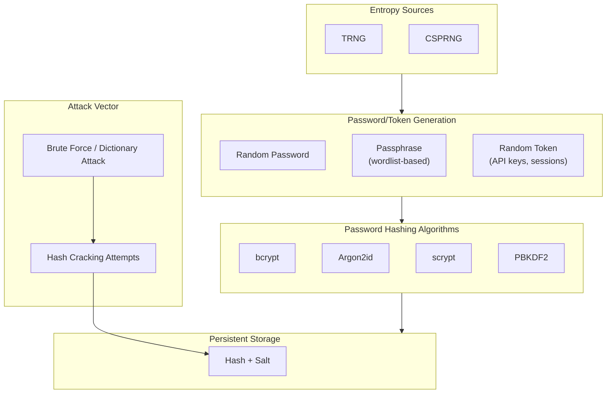

# Password Hashing Algorithms

Password hashing algorithms are a specific type of hash function designed to store and verify passwords securely.

> [!NOTE]
> Password hashing algorithms are intentionally slow and computationally intensive, making brute-force attacks significantly more difficult.

- [1. Category](#1-category)
  - [1.1. Argon2](#11-argon2)
  - [1.2. Scrypt](#12-scrypt)
  - [1.3. Bcrypt](#13-bcrypt)
  - [1.4. PBKDF2](#14-pbkdf2)
- [2. Best Practice](#2-best-practice)
- [3. Terminology](#3-terminology)
- [4. References](#4-references)

## 1. Category



### 1.1. Argon2

Argon2 is a password-hashing function that summarizes the state of the art in the design of memory-hard functions and can be used to hash passwords for credential storage, key derivation, or other applications. Argon2 is resistant to GPU cracking attacks and optimized to resist side-channel attacks.

1. Schema and Format

    ```plaintext
    $<algorithm>$v=<version>$m=<memory>,t=<iterations>,p=<parallelism>$<salt>$<hash>
    ```

    - `algorithm`
      > Identifier of the Argon2 algorithm variants.
      >
      > - **argon2d** provides resistance against GPU cracking attacks, but has potential side-channel attacks.
      >
      > - **argon2i** provides less GPU resistance, but strong side-channel attack resistance.
      >
      > - **argon2id** is a hybrid of `argon2i` and `argon2d`, using a combination of data-dependent and data-independent memory accesses.

    - `v`
      > Provides the algorithm version.

    - `m, t, p`
      > Provides parameters:
      >
      > - **m** memory cost, which defines the memory usage, given in kibibytes.
      >
      > - **t** time cost, which defines the amount of computation realized.
      >
      > - **p** parallelism degree, which defines the number of parallel threads.

    - `salt`
      > Unique random data used in the hashing process.

    - `hash`
      > The result of the Argon2 hashing process.

2. Output and Result

    Argon2 is a password hashing algorithm that produces an encoded hash string with multiple sections separated by dollar signs `$`.

    ```plaintext
    $argon2id$v=19$m=65536,t=2,p=4$c29tZXNhbHQ$xBZi7BvdgwwMVMEVqoV7jQ
    ```

    - `argon2id`
      > The variant of the Argon2 algorithm, `argon2id` is usually the recommended version.

    - `v=19`
      > The version of the Argon2 algorithm.

    - `m=65536,t=2,p=4`
      > The parameters of the Argon2 algorithm. `m` stands for memory (in kibibytes), `t` for time (the number of iterations), and `p` for parallelism (the number of threads).

    - `c29tZXNhbHQ`
      > The salt value that is unique per user. It's used to prevent pre-computed hash attacks like rainbow tables.

    - `xBZi7BvdgwwMVMEVqoV7jQ`
      > The actual hash of the password.

3. Tools and Frameworks

    > [!NOTE]
    > Always use a well-maintained and trusted library or framework when dealing with password hashing and cryptographic operations.

    - C/C++

      - [Argon2](https://github.com/P-H-C/phc-winner-argon2)
        > The reference C implementation of Argon2, the password-hashing function that won the Password Hashing Competition (PHC).

      - [libsodium](https://github.com/jedisct1/libsodium)
        > libsodium is a portable, cross-compilable, installable, packageable, API-compatible version of NaCl (Networking and Cryptography library). It implements network communication, encryption, decryption, signatures, and password hashing like Argon2 and Scrypt.

    - JavaScript

      - [argon2](https://www.npmjs.com/package/argon2)
        > A fast and reliable Node.js binding to the Argon2 library.

    - Python

      - [argon2-cffi](https://pypi.org/project/argon2-cffi/)
        > A CFFI-based Argon2 library that provides both low-level and high-level interfaces to Argon2.

      - [Django](https://docs.djangoproject.com/en/4.2/topics/auth/passwords/)
        > Django is a high-level Python Web framework that encourages rapid development and clean, pragmatic design. Django provides PBKDF2 as the default password hashing algorithm and supports Argon2, and Bcrypt.

    - Java

      - [argon2-jvm](https://github.com/phxql/argon2-jvm)
        > An Argon2 library for the JVM.

    - Ruby

      - [argon2](https://github.com/technion/ruby-argon2)
        > The Ruby gem for the Argon2 password hash.

    - PHP

      - [password_hash](https://www.php.net/manual/en/function.password-hash.php)
        > PHP's built-in function support for Argon2.

    - C#/.NET

      - [Konscious.Security.Cryptography.Argon2](https://www.nuget.org/packages/Konscious.Security.Cryptography.Argon2/)
        > A .NET library that provides an Argon2 implementation.

4. Examples and Explanations

    - `argon2.py`
      > Python script using the `argon2-cffi` library.

      ```python
      from argon2 import PasswordHasher

      ph = PasswordHasher()

      def hash_password(password):
          try:
              hash = ph.hash(password)
              return hash
          except Exception as e:
              print(f"An error occurred while hashing the password: {e}")
              return None

      def verify_password(hashed_password, password):
          try:
              verify_valid = ph.verify(hashed_password, password)
              return verify_valid
          except Exception as e:
              print(f"An error occurred while verifying the password: {e}")
              return False

      # Usage
      hashed_password = hash_password("my password")
      print('Hashed Password:', hashed_password)

      is_match = verify_password(hashed_password, "my password")
      print('Do passwords match?:', is_match)
      ```

### 1.2. Scrypt

Scrypt is a password-based key derivation function designed to be memory-hard. It uses a large amount of memory to make it more difficult to implement parallel attacks, and is resistant to attacks using ASICs or GPUs.

1. Schema and Format

    > [!NOTE]
    > Scrypt doesn't have a universal standard format for storing hashed passwords like bcrypt, but a common scheme is widely used.

    ```plaintext
    <algorithm>:<parameters>:<salt>:<hash>
    ```

    - `algorithm`
      > The identifier of the scrypt algorithm.

    - `parameters`
      > - **N** the CPU/memory cost factor.
      >
      > - **r** the block size.
      >
      > - **p** the parallelization factor.

    - `salt`
      > A random value that's generated when the password is hashed. It's used to prevent pre-computed hash attacks (like rainbow tables). The salt is often stored in base64 format.

    - `hash`
      > The actual hash of the password, also often stored in base64 format.

2. Output and Result

    ```plaintext
    scrypt:N=16384,r=8,p=1:D2ftml5uxi3Trgx2:hc3B4fPQyaWS7amGfT+NZ+RjFPTxH0l7N0+qWr7ITmc=
    ```

    - `scrypt`
      > The algorithm identifier.

    - `N=16384,r=8,p=1`
      > The parameters.

    - `D2ftml5uxi3Trgx2`
      > The salt value.

    - `hc3B4fPQyaWS7amGfT+NZ+RjFPTxH0l7N0+qWr7ITmc=`
      > The hashed password.

3. Tools and Frameworks

    > [!NOTE]
    > Always use a well-maintained and trusted library or framework when dealing with password hashing and cryptographic operations.

    - C/C++

      - [OpenSSL](https://github.com/openssl/openssl)
        > OpenSSL is a robust, commercial-grade, and full-featured toolkit for the Transport Layer Security (TLS) and Secure Sockets Layer (SSL) protocols. It is also a general-purpose cryptography library. It implements Scrypt as a key derivation function.

      - [libsodium](https://github.com/jedisct1/libsodium)
        > libsodium is a portable, cross-compilable, installable, packageable, API-compatible version of NaCl (Networking and Cryptography library). It implements network communication, encryption, decryption, signatures, and password hashing like Argon2 and Scrypt.

    - JavaScript

      - [scrypt.js](https://www.npmjs.com/package/scrypt.js)
        > A pure JavaScript implementation of the scrypt parameters encoding function.

      - [scryptsy](https://www.npmjs.com/package/scryptsy)
        > A JavaScript implementation of scrypt.

    - Python

      - [scrypt](https://pypi.org/project/scrypt/)
        > A Python wrapper for the scrypt hash function.

    - Java

      - [Bouncy Castle](https://www.bouncycastle.org/)
        > A cryptography API that includes support for scrypt.

    - Ruby

      - [scrypt](https://rubygems.org/gems/scrypt/)
        > A Ruby gem for the scrypt password hashing algorithm.

    - PHP

      - [password_hash](https://www.php.net/manual/en/function.password-hash.php)
        > PHP's built-in function support for scrypt.

    - C#/.NET

      - [CryptSharp](https://www.zer7.com/software/cryptsharp)
        > A C# library that includes support for scrypt.

4. Examples and Explanations

    - `scrypt.go`
      > Golang source file using the Go built-in compatible `scrypt` package from `golang.org/x/crypto`.

      ```go
      package main

      import (
        "crypto/rand"
        "crypto/subtle"
        "encoding/base64"
        "fmt"
        "log"

        "golang.org/x/crypto/scrypt"
      )

      func generateSalt() ([]byte, error) {
        salt := make([]byte, 8)
        _, err := rand.Read(salt)
        return salt, err
      }

      func hash(password string, salt []byte) (string, error) {
        derivedKey, err := scrypt.Key([]byte(password), salt, 32768, 8, 1, 32)
        if err != nil {
          return "", err
        }
        return base64.StdEncoding.EncodeToString(derivedKey), nil
      }

      func verify(password, encodedHash string, salt []byte) (bool, error) {
        derivedKey, err := scrypt.Key([]byte(password), salt, 32768, 8, 1, 32)
        if err != nil {
          return false, err
        }
        computedHash := base64.StdEncoding.EncodeToString(derivedKey)
        return subtle.ConstantTimeCompare([]byte(encodedHash), []byte(computedHash)) == 1, nil
      }

      func main() {
        password := "secret"

        salt, err := generateSalt()
        if err != nil {
          log.Fatal(err)
        }

        hashed, err := hash(password, salt)
        if err != nil {
          log.Fatal(err)
        }

        fmt.Println("Password:", password)
        fmt.Println("Salt:    ", base64.StdEncoding.EncodeToString(salt))
        fmt.Println("Hash:    ", hashed)

        match, err := verify(password, hashed, salt)
        if err != nil {
          log.Fatal(err)
        }

        fmt.Println("Match:   ", match)
      }
      ```

### 1.3. Bcrypt

Bcrypt is a password hashing function based on the Blowfish cipher. It incorporates a salt to protect against rainbow table attacks and is adaptive over time. The cost factor can be increased to keep brute-force attacks expensive as computing power grows.

1. Schema and Format

    ```plaintext
    $<id>$<cost>$<salt><hash>
    ```

    - `id`
      > Identifies the bcrypt algorithm variant, such as `2a`, `2y`, or `2b`.

      > [!NOTE]
      > Prefer `2b` for new hashes where available. Legacy systems may still contain `2a` or `2y` hashes.

    - `cost`
      > Represents the cost factor or number of iterations.

    - `salt`
      > Unique random data used in the hashing process.

    - `hash`
      > The actual result of the Bcrypt hashing process.

2. Output and Result

    > [!NOTE]
    > Comparing a password for authentication, the same version and cost factor are used, along with the salt extracted from the stored hash. This generates a new hashed value that is compared with the stored hash.

    ```plaintext
    $2a$10$N9qoB1Qa5Kf3g0VwSzBZjuI7kI.ZEXa2G7pESKg1OfveJgp3wCqTS
    ```

    - `$2a$`
      > The bcrypt algorithm identifier. In this example, `2a` denotes the variant.

    - `10$`
      > The cost factor controls how much computation is required to hash and verify a password. Higher values increase resistance to brute-force attacks, but also increase authentication latency.

    - `N9qoB1Qa5Kf3g0VwSzBZjuI7kI.ZEXa2G7pESKg1OfveJgp3wCqTS`
      > bcrypt encodes its result in a modified Base64 format. In this representation, the first 22 characters are the `salt`, and the remaining 31 characters are the hash output.

3. Tools and Frameworks

    > [!NOTE]
    > Always use a well-maintained and trusted library or framework when dealing with password hashing and cryptographic operations.

    - JavaScript

      - [bcrypt.js](https://www.npmjs.com/package/bcryptjs)
        > A pure JavaScript implementation of BCrypt.

      - [bcrypt](https://www.npmjs.com/package/bcrypt)
        > A package that provides bindings to the native BCrypt library.

      - [node.bcrypt.js](https://github.com/kelektiv/node.bcrypt.js)
        > Node.js implementation of bcrypt.

    - Python

      - [bcrypt](https://pypi.org/project/bcrypt/)
        > A Python module that provides a simple wrapper around the OpenBSD implementation of BCrypt.

      - [Django](https://docs.djangoproject.com/en/4.2/topics/auth/passwords/)
        > Django is a high-level Python Web framework that encourages rapid development and clean, pragmatic design. Django provides PBKDF2 as the default password hashing algorithm and supports Argon2, and Bcrypt.

    - Java

      - [jBCrypt](http://www.mindrot.org/projects/jBCrypt/)
        > A Java implementation of OpenBSD's Blowfish password hashing code, as described in `A Future-Adaptable Password Scheme` by Niels Provos and David Mazières.

    - Ruby

      - [bcrypt](https://rubygems.org/gems/bcrypt/)
        > A Ruby binding for the OpenBSD BCrypt() password hashing algorithm, allowing to store a secure hash of user passwords.

    - PHP

      - [password_hash](https://www.php.net/manual/en/function.password-hash.php)
        > PHP's built-in function support for BCrypt.

    - C#/.NET

      - [BCrypt.Net](https://www.nuget.org/packages/BCrypt.Net-Next/)
        > A .NET implementation of BCrypt.

4. Examples and Explanations

    - `bcrypt.go`
      > Golang source file using the `bcrypt` package from `golang.org/x/crypto`.

      ```go
      package main

      import (
        "fmt"
        "log"

        "golang.org/x/crypto/bcrypt"
      )

      func hash(password string) (string, error) {
        bytes, err := bcrypt.GenerateFromPassword([]byte(password), 14)
        return string(bytes), err
      }

      func verify(password, hash string) (bool, error) {
        err := bcrypt.CompareHashAndPassword([]byte(hash), []byte(password))
        return err == nil
      }

      func main() {
        password := "secret"

        hash, err := hash(password)
        if err != nil {
          log.Fatal(err)
        }

        fmt.Println("Password:", password)
        fmt.Println("Hash:    ", hash)

        match, err := verify(password, hash)
        if err != nil {
          log.Fatal(err)
        }

        fmt.Println("Match:   ", match)
      }
      ```

### 1.4. PBKDF2

PBKDF2 (Password-Based Key Derivation Function 2) is a key derivation function that applies a pseudorandom function, such as a hash-based message authentication code (HMAC), to the input password or passphrase along with a salt value and repeats the process many times to produce a derived key.

1. Schema and Format

    > [!NOTE]
    > PBKDF2 (Password-Based Key Derivation Function 2) doesn't have a universal standard format for storing hashed passwords like bcrypt, but a common scheme is widely used.

    ```plaintext
    <algorithm>:<iterations>:<salt>:<hash>
    ```

    - `algorithm`
      > The hash algorithm used in the PBKDF2 function, such as `SHA256` or `SHA512`.

    - `iterations`
      > The number of iterations the PBKDF2 function goes through, and it can be adjusted to increase the computation time as hardware gets faster.

    - `salt`
      > A random value that's generated when the password is hashed. It's used to prevent pre-computed hash attacks (rainbow tables). The salt is often stored in base64 format.

    - `hash`
      > The actual hash of the password, also often stored in base64 format.

2. Output and Result

    ```plaintext
    pbkdf2_sha256:10000:8u43jr93idfncm:LKFoO4JAnMAvdHnTOIIPtBkB91wYSWdqUVJ/QFZyL6k=
    ```

    - `pbkdf2_sha256`
      > The algorithm

    - `10000`
      > The number of iterations

    - `8u43jr93idfncm`
      > The salt value.

    - `LKFoO4JAnMAvdHnTOIIPtBkB91wYSWdqUVJ/QFZyL6k=`
      > The hashed password.

3. Tools and Frameworks

    > [!NOTE]
    > Always use a well-maintained and trusted library or framework when dealing with password hashing and cryptographic operations.

    - JavaScript

      - [crypto-js](https://www.npmjs.com/package/crypto-js)
        > A collection of cryptographic algorithms implemented in JavaScript.

      - [crypto](https://nodejs.org/api/crypto.html)
        > Node.js' built-in module for cryptographic functionality including PBKDF2.

    - Python

      - [hashlib](https://docs.python.org/3/library/hashlib.html)
        > Python's standard library for hash functions including PBKDF2.

      - [passlib](https://passlib.readthedocs.io/en/stable/lib/passlib.hash.pbkdf2_digest.html)
        > A password hashing library with support for PBKDF2.

      - [Django](https://docs.djangoproject.com/en/4.2/topics/auth/passwords/)
        > Django is a high-level Python Web framework that encourages rapid development and clean, pragmatic design. Django provides PBKDF2 as the default password hashing algorithm and supports Argon2, and Bcrypt.

    - Java

      - [Java Cryptography Architecture (JCA)](https://docs.oracle.com/en/java/javase/11/security/java-cryptography-architecture-jca-reference-guide.html)
        > Java's built-in architecture for cryptographic functionality including PBKDF2.

    - Ruby

      - [OpenSSL::PKCS5](https://ruby-doc.org/stdlib-2.4.0/libdoc/openssl/rdoc/OpenSSL/PKCS5.html)
        > Ruby's OpenSSL library provides a method for PBKDF2.

    - PHP

      - [hash_pbkdf2](https://www.php.net/manual/en/function.hash-pbkdf2.php)
        > PHP's built-in function support.

    - C#/.NET

      - [.NET's Rfc2898DeriveBytes Class](https://docs.microsoft.com/en-us/dotnet/api/system.security.cryptography.rfc2898derivebytes)
        > Password-based key derivation functionality for PBKDF2, including implementations based on HMAC.

4. Examples and Explanations

    - `pbkdf2.py`
      > Python script using the `hashlib` and `binascii` libraries which are part of Python's standard library.

      ```python
      import hashlib
      import binascii
      import os

      def hash_password(password):
          """Hash a password for storing."""
          salt = hashlib.sha256(os.urandom(60)).hexdigest().encode('ascii')
          pwdhash = hashlib.pbkdf2_hmac('sha512', password.encode('utf-8'), salt, 100000)
          pwdhash = binascii.hexlify(pwdhash)
          return (salt + pwdhash).decode('ascii')

      def verify_password(stored_password, provided_password):
          """Verify a stored password against one provided by user"""
          salt = stored_password[:64]
          stored_password = stored_password[64:]
          pwdhash = hashlib.pbkdf2_hmac('sha512', provided_password.encode('utf-8'), salt.encode('ascii'), 100000)
          pwdhash = binascii.hexlify(pwdhash).decode('ascii')
          return pwdhash == stored_password

      # Usage
      hashed_password = hash_password('my_password')
      print('Hashed Password:', hashed_password)

      is_match = verify_password(hashed_password, 'my_password')
      print('Do passwords match?:', is_match)
      ```

## 2. Best Practice

- Strong Algorithm
  > Always use a strong and well-vetted cryptographic hash function, such as Argon2, scrypt, bcrypt or PBKDF2. Do not use weak or broken hash functions like MD5 or SHA-1.

- Salt
  > Always use a unique salt for each user’s password. This makes pre-computed hash attacks, like rainbow table attacks, infeasible.

- Work Factors
  > The work factor or cost factor for the hashing function should be set as high as possible without causing unacceptable delay for users. This makes brute force attacks more time-consuming.

- Slow
  > Password hashing algorithms are intentionally slow to make brute-force attacks more difficult. This slows down attackers who try to guess passwords by hashing them repeatedly until they find a match.

- Irreversible
  > Password hashing algorithms are non-reversible, meaning that it is computationally infeasible to determine the password from the hash value. This helps ensure that even if an attacker gains access to the password hash values, they cannot easily determine the passwords themselves.

- Regular Updates
  > Regularly update the password hashing strategy to keep up with increasing computational power and advancements in attack methods. Consider increasing the work factor and rehashing all passwords when users next log in.

- Rate Limiting
  > Implement rate limiting to prevent brute force attacks.

## 3. Terminology

- Hashing
  > The process of transforming input of any length into a fixed-size string using a mathematical function.

- Salt
  > Random data used as additional input to a one-way function that hashes data, such as a password or passphrase. Salts defend against dictionary attacks and precomputed rainbow table attacks.

- Pepper
  > A secret value added to the hashing process to harden password storage. Unlike a salt (which is stored alongside the hash), a pepper must remain secret.

- Work Factor/Cost Factor
  > Parameters that determine how computationally expensive the hashing process is. The work factor is usually configurable so that as hardware gets faster, the hash function can remain resistant to brute-force search attacks.

- Key Derivation Function (KDF)
  > In cryptography, a key derivation function derives one or more secret keys from a secret value such as a master key, a password, or a passphrase using a pseudorandom function.

- Collision
  > It is a situation that occurs when two different data inputs produce the same hash output.

- Digest
  > The output of a hash function.

- Rainbow Tables
  > Rainbow tables are a time-memory trade-off technique. They are used to crack password hashes, reducing the time for cracking but increasing the memory used. A rainbow table consists of precomputed hash function outputs for a large number of potential inputs.

- Rainbow Table Attack
  > A type of attack on a password hash that involves precomputing the hashes of many passwords and then comparing a given hash with the precomputed values to find a match and therefore the original password.

- Brute-force Attack
  > A trial and error method used by application programs to decode encrypted data such as passwords through exhaustive effort rather than employing intellectual strategies.

- Dictionary Attack
  > A method of breaking a hashed password by trying all the possible plaintext permutations.

- Cryptographic Hash Function
  > A mathematical algorithm that takes input and returns a fixed-size output (digest). It is one-way, meaning the original input cannot feasibly be recovered from the digest.

## 4. References

- Sentenz [Cryptography](../articles/cryptography.md) article.
- OWASP [Password Storage](https://cheatsheetseries.owasp.org/cheatsheets/Password_Storage_Cheat_Sheet.html) page.
- Hive [Password Brute Force Benchmark](https://www.hivesystems.com/passwords) page.
