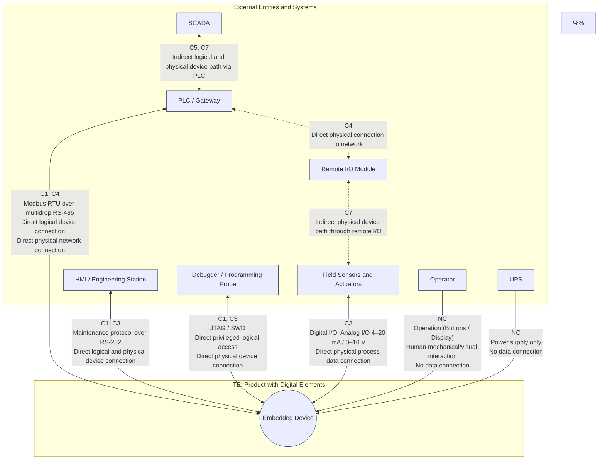
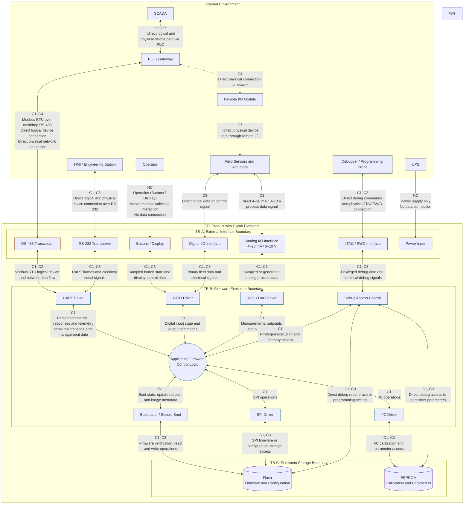

# Threat Modeling

Threat modeling is a structured process for identifying, analyzing, and prioritizing security threats to a system with the goal of defining appropriate mitigations. It is a proactive approach to security that helps organizations understand their attack surface, identify potential vulnerabilities, and implement controls to reduce risk before systems are built or deployed.

- [1. Benefits](#1-benefits)
- [2. Principles](#2-principles)
- [3. Category](#3-category)
  - [3.1. Threat Actors](#31-threat-actors)
    - [3.1.1. Nation-State Actors / Advanced Persistent Threats (APTs)](#311-nation-state-actors--advanced-persistent-threats-apts)
    - [3.1.2. Insider Threats](#312-insider-threats)
    - [3.1.3. Cybercriminals](#313-cybercriminals)
    - [3.1.4. Hacktivists](#314-hacktivists)
    - [3.1.5. Thrill Seekers](#315-thrill-seekers)
  - [3.2. Threat Layers](#32-threat-layers)
    - [3.2.1. Connection Paths](#321-connection-paths)
    - [3.2.2. Depth Layers](#322-depth-layers)
    - [3.2.3. Diagram Layers](#323-diagram-layers)
      - [3.2.3.1. Depth Layer 0](#3231-depth-layer-0)
      - [3.2.3.2. Depth Layer 2](#3232-depth-layer-2)
  - [3.3. Threat Frameworks](#33-threat-frameworks)
    - [3.3.1. STRIDE](#331-stride)
    - [3.3.2. PASTA](#332-pasta)
    - [3.3.3. DREAD](#333-dread)
    - [3.3.4. LINDDUN](#334-linddun)
    - [3.3.5. OCTAVE](#335-octave)
    - [3.3.6. Attack Trees](#336-attack-trees)
    - [3.3.7. TARA](#337-tara)
    - [3.3.8. BSI Likelihood of Exploit](#338-bsi-likelihood-of-exploit)
    - [3.3.9. MITRE ATT\&CK](#339-mitre-attck)
    - [3.3.10. MITRE EMB3D](#3310-mitre-emb3d)
  - [3.4. Terminology](#34-terminology)
- [4. References](#4-references)

## 1. Benefits

- Proactive Defense
  > Threat modeling surfaces threats and attack paths during design, producing concrete findings, threat descriptions, affected assets, root causes, and recommended mitigations before they can be built into the system.

- Residual Risk Reduction
  > Applying mitigations systematically reduces residual risk to an acceptable level. Risks that persist after mitigation must be explicitly accepted by a named stakeholder, ensuring no unowned risk remains undocumented.

- Attack Surface Reduction
  > Mapping data flows and trust boundaries highlights unnecessary interfaces, open services, and over-privileged components that can be removed or hardened, directly lowering the set of exploitable targets.

- Reduced Remediation Costs
  > Identifying design-level issues early avoids the compounding costs of rework, regression testing, and incident response that arise when the same issues are discovered post-release.

- Compliance Support
  > Threat modeling produces documented risk assessments and mitigation decisions that support compliance with frameworks such as ISO/IEC 27005, NIST SP 800-30, IEC 62443-4-1, and GDPR Article 25.

- Improved Communication and Traceability
  > Threat modeling creates a shared record that links threats to mitigations, owners, and acceptance decisions, improving cross-team communication and providing an audit trail for future architecture reviews and security assessments.

## 2. Principles

- Security by Design
  > Threat modeling embeds security thinking into architecture decisions rather than treating it as an afterthought. The result is systems where security controls are integral to the design rather than retrofitted after the fact.

- Least Privilege
  > Threat modeling identifies where excessive permissions or access rights exist across users, services, and components, enabling the design of systems that operate with the minimum necessary privileges to limit the impact of a compromise.

- Defense in Depth
  > By identifying multiple attack paths and their corresponding mitigations, threat modeling promotes layered defenses so that no single point of failure exposes the system to an attacker.

- CIA Triad
  > Threat modeling classifies each identified threat by the security property it violates: Confidentiality, Integrity, or Availability, ensuring that mitigations directly address the specific risk to each property.

- Risk-Based Prioritization
  > Threat modeling ranks identified threats by likelihood and impact so that security effort is directed at the highest-priority risks first, rather than applied uniformly across all findings.

- Adversary-Centric Modeling
  > Threats are identified and analyzed from the attacker's perspective, grounded in realistic Tactics, Techniques, and Procedures (TTPs) drawn from knowledge bases such as MITRE ATT&CK, ensuring mitigations address actual attack paths rather than hypothetical ones.

## 3. Category

### 3.1. Threat Actors

Threat actors are individuals, groups, or organizations with the motivation and capability to carry out attacks against systems, data, or infrastructure.

| Threat Actor       | Typical Capability Boundary                                                                                                       |
| ------------------ | --------------------------------------------------------------------------------------------------------------------------------- |
| Thrill Seeker      | Opportunistic use of public tooling, default credentials, or exposed services.                                                    |
| Hacktivist         | Public-facing OT access used for symbolic disruption, defacement, or proof-of-access.                                             |
| Cybercriminal      | Financially motivated compromise, ransomware, extortion, credential theft, or scalable supply-chain abuse.                        |
| Insider Threat     | Trusted local, physical, engineering, maintenance, or privileged plant access.                                                    |
| Nation-State Actor | State-sponsored actors with significant resources, custom tooling, and long-duration campaigns targeting critical infrastructure. |

#### 3.1.1. Nation-State Actors / Advanced Persistent Threats (APTs)

Nation-states are highly sophisticated threat actors with significant resources, often motivated by geopolitical objectives, espionage, or disruption. APTs are a subset of nation-state actors that conduct prolonged, targeted campaigns against specific organizations or sectors, often using custom malware and zero-day exploits to achieve their objectives.

#### 3.1.2. Insider Threats

Insiders are individuals with legitimate access to organizational systems who may cause harm through malicious intent, negligence, or compromise by an external party.

- Malicious Insiders
  > Deliberately exfiltrate data or sabotage systems for personal gain, grievance, or coercion.
  
- Negligent Insiders
  > Unintentionally expose sensitive data through misconfiguration, policy violations, or susceptibility to social engineering.
  
- Compromised Insiders
  > Manipulated or coerced by external threat actors to act on their behalf.

#### 3.1.3. Cybercriminals

Cybercriminals are financially motivated threat actors who pursue illicit profit through ransomware, data theft, fraud, and account compromise. They range from individual opportunistic actors to structured groups that operate affiliate programs, sell access to compromised systems, and offer exploitation capabilities as commercial services.

#### 3.1.4. Hacktivists

Hacktivists are ideologically motivated threat actors who target organizations to promote a cause or agenda, often through defacement, DDoS attacks, or data leaks.

#### 3.1.5. Thrill Seekers

Thrill seekers, also known as script kiddies, are low-skill threat actors who rely on pre-built exploit kits, publicly available scripts, and automated tools to conduct opportunistic attacks, typically motivated by curiosity, notoriety, or the thrill of unauthorized access rather than targeted objectives.

### 3.2. Threat Layers

#### 3.2.1. Connection Paths

Connection paths are classified as either [direct or indirect, logical or physical data connection to a device or network](https://eur-lex.europa.eu/legal-content/EN/TXT/HTML/?uri=OJ:L_202402847#art_2) and [definitions](https://eur-lex.europa.eu/legal-content/EN/TXT/HTML/?uri=OJ:L_202402847#art_3) of connection path, connection type, and target.

| Case | Connection Path | Connection Type | Target  | Interpretation                                 | Representative                                                                                                                                                                                                                                                             |
| ---- | --------------- | --------------- | ------- | ---------------------------------------------- | -------------------------------------------------------------------------------------------------------------------------------------------------------------------------------------------------------------------------------------------------------------------------- |
| C1   | Direct          | Logical         | Device  | Direct logical data connection to a device     | Addressed Modbus RTU request/response between a PLC and the embedded device, RS-232/UART console protocol, JTAG/SWD debug commands, managed UPS protocol, local bootloader commands, SPI/I²C read/write operations targeting EEPROM or Flash                               |
| C2   | Direct          | Logical         | Network | Direct logical data connection to a network    | Modbus RTU communication on an RS-485 multidrop segment, network-wide diagnostics or discovery, broadcast Modbus requests, maintenance software interacting directly with the shared serial network                                                                        |
| C3   | Direct          | Physical        | Device  | Direct physical data connection to a device    | Point-to-point RS-232 cable, JTAG/SWD Probe connection, GPIO, Digital I/O, Analog I/O 4–20 mA / 0–10 V, UART TX/RX wiring, SPI/I²C traces to EEPROM/Flash, USB service cable, PLC or managed-UPS serial attachment                                                         |
| C4   | Direct          | Physical        | Network | Direct physical data connection to a network   | RS-485 multidrop bus, trunk wiring, termination and device transceiver attachment, direct physical connection to a shared serial fieldbus, USB bus or hub only where the bus itself is explicitly modeled as a network                                                     |
| C5   | Indirect        | Logical         | Device  | Indirect logical data connection to a device   | Maintenance Workstation → PLC/gateway → Embedded Device, HMI request relayed by the PLC, firmware-update command relayed to the bootloader, EEPROM or Flash access performed indirectly through application firmware or the bootloader                                     |
| C6   | Indirect        | Logical         | Network | Indirect logical data connection to a network  | Maintenance Workstation/HMI → protocol gateway or serial server → Modbus RTU network, access to the RS-485 network through a PLC, remote diagnostic software reaching the field network through an intermediary                                                            |
| C7   | Indirect        | Physical        | Device  | Indirect physical data connection to a device  | Sensor or actuator connected through remote I/O, relay, isolator, signal conditioner or transmitter, maintenance workstation connected through a USB-to-RS-232 adapter, physical programming path through an adapter board, UPS management path through a serial converter |
| C8   | Indirect        | Physical        | Network | Indirect physical data connection to a network | Maintenance Workstation → USB-to-RS-485 adapter/serial server → RS-485 bus, internal MCU connected to the external multidrop network through an RS-485 transceiver and board connector, physical access to a fieldbus through a protocol gateway                           |

#### 3.2.2. Depth Layers

[Diagram depth layers](https://learn.microsoft.com/en-us/training/modules/tm-provide-context-with-the-right-depth-layer/1b-depth-layers) are used to decompose a system into hierarchical levels of detail, enabling threat modeling at varying levels of abstraction.

| Layer | Title       | Components                                                                                                                                                                                                                                                                          | Description                                                                                                                                                                                                                                                                                                                                                                                                                                                                                                                                                     |
| ----- | ----------- | ----------------------------------------------------------------------------------------------------------------------------------------------------------------------------------------------------------------------------------------------------------------------------------- | --------------------------------------------------------------------------------------------------------------------------------------------------------------------------------------------------------------------------------------------------------------------------------------------------------------------------------------------------------------------------------------------------------------------------------------------------------------------------------------------------------------------------------------------------------------- |
| 0     | System      | Embedded Device, PLC, HMI/Engineering Station, Maintenance Workstation, Debug/Flash Probe, Managed UPS, Sensors, Actuators, Remote I/O, Protocol Gateway/Serial Server, USB Host or Service Laptop                                                                                  | Mandatory initial view of the systems major parts. Represents the Embedded Device as a single process within its trust boundary and shows all relevant external entities, intermediary systems, data flows, and physical or logical connection paths. Establishes the system context and identifies the Layer 0 processes that may require further decomposition.  ([Microsoft Layer 0][1])                                                                                                                                                                     |
| 1     | Process     | Controller/MCU, RS-485 Transceiver, RS-232 Transceiver, USB Interface, JTAG/SWD Interface, RJ-12/RJ-45 Connectors, GPIO Interface, Digital I/O, Analog I/O, Power Monitoring, Flash, EEPROM                                                                                         | Decomposes the Embedded Device process from Layer 0 into its principal board-level processes, interfaces, data stores, and trust boundaries. Identifies the products external physical and logical attack surfaces while retaining the Controller/MCU as a single process. Generally the appropriate minimum decomposition for evaluating an embedded product’s communication ports, field I/O, debug interface, storage, and service interfaces.  ([Microsoft Layer 1][2])                                                                                     |
| 2     | Subprocess  | Application and Control Logic, Modbus RTU Stack, GPIO Driver, UART Driver, SPI Driver, I²C Driver, Digital-I/O Driver, ADC/DAC Driver, Scheduler/Interrupt Dispatch, Configuration Manager, Bootloader, Secure Boot, Firmware-Update Manager, Debug-Access Control, Memory Manager  | Decomposes the Controller/MCU process from Layer 1 into security-relevant firmware subprocesses and data flows. Focuses on protocol parsing, control decisions, privilege boundaries, interrupt handling, secure startup, firmware updates, debug authorization, configuration processing, and non-volatile-memory access. Appropriate where compromise of an internal controller function could affect device integrity, availability, process control, or connected systems.  ([Microsoft Layer 2][3])                                                        |
| 3     | Lower-Level | Modbus RTU Frame Parser and Function Handlers, Boot Verification Chain, Firmware-Update State Machine, Signature Verification, Anti-Rollback Logic, UART ISR/DMA and Buffers, GPIO Interrupt/Debounce Logic, SPI/I²C Transaction State Machines, MPU Regions, Key-Handling Routines | Provides minute implementation detail for a selected critical Layer 2 subprocess rather than automatically decomposing the entire controller. Examines parser memory safety, input-validation branches, state transitions, buffer ownership, concurrency, cryptographic verification, privilege changes, key exposure, fault injection, and side-channel behavior. Reserved for security-critical, kernel-level, privileged, cryptographic, or timing-sensitive functions where Layer 2 does not provide sufficient analytical depth.  ([Microsoft Layer 3][4]) |

[1]: https://learn.microsoft.com/en-us/training/modules/tm-provide-context-with-the-right-depth-layer/2-layer-0-the-system-layer "Layer 0 | The System Layer Training | Microsoft Learn"
[2]: https://learn.microsoft.com/en-us/training/modules/tm-provide-context-with-the-right-depth-layer/3-layer-1-the-process-layer "Layer 1 | The Process Layer Training | Microsoft Learn"
[3]: https://learn.microsoft.com/en-us/training/modules/tm-provide-context-with-the-right-depth-layer/4-layer-2-the-sub-process-layer "Layer 2 | The Subprocess Layer Training | Microsoft Learn"
[4]: https://learn.microsoft.com/en-us/training/modules/tm-provide-context-with-the-right-depth-layer/5-layer-3-the-lower-level-layer "Layer 3 | The Lower-Level Layer Training | Microsoft Learn"

#### 3.2.3. Diagram Layers

##### 3.2.3.1. Depth Layer 0

At depth layer 0, the embedded product is represented as a single system node. Internal elements such as the bootloader, Flash, EEPROM, protocol stack, drivers, and application firmware are intentionally omitted.

##### 3.2.3.2. Depth Layer 2

At depth layer 2, the embedded device is decomposed into its major functional blocks (processes) and critical sub‑processes. Internal data flows, trust boundaries, and interfaces between components are shown, enabling detailed threat analysis of the device's attack surface and internal architecture.

### 3.3. Threat Frameworks

Threat modeling provides structured methodologies for systematically identifying, categorizing, and analyzing threats. The choice of framework depends on the system type, team expertise, and desired level of rigor.

#### 3.3.1. STRIDE

STRIDE is a threat categorization model developed by Microsoft that classifies threats into six categories mapped to violated security properties. It is widely used during design reviews and is well-suited for analyzing individual components and trust boundaries in a Data Flow Diagram.

1. Concepts and Components

    | Threat Category        | Violated Property | Description                                                                                              |
    | ---------------------- | ----------------- | -------------------------------------------------------------------------------------------------------- |
    | Spoofing               | Authentication    | Impersonating another user, process, or system to gain unauthorized access.                              |
    | Tampering              | Integrity         | Unauthorized modification of data in transit, at rest, or in process.                                    |
    | Repudiation            | Non-repudiation   | Denying that an action was performed when the system lacks sufficient audit evidence to prove otherwise. |
    | Information Disclosure | Confidentiality   | Exposure of data to unauthorized parties.                                                                |
    | Denial of Service      | Availability      | Disrupting system availability by exhausting resources or crashing services.                             |
    | Elevation of Privilege | Authorization     | Gaining capabilities beyond those which were intended or authorized.                                     |

#### 3.3.2. PASTA

PASTA (Process for Attack Simulation and Threat Analysis) is a seven-stage, risk-centric threat modeling methodology that aligns threat analysis with business objectives. It focuses on simulating real attacker behavior and quantifying risk in business terms, making it well-suited for enterprise environments where threat modeling must feed into risk management decisions.

1. Workflow and Stages

    - Define Objectives
      > Establish business and security objectives, compliance requirements, and acceptable risk thresholds.

    - Define Technical Scope
      > Enumerate technical components, infrastructure, and dependencies in scope for the analysis.

    - Application Decomposition
      > Decompose the application into components, data flows, trust boundaries, and entry/exit points using DFDs and architectural diagrams.

    - Threat Analysis
      > Identify relevant threat agents, threat communities, and attack scenarios using threat intelligence sources.

    - Vulnerability and Weakness Analysis
      > Map known vulnerabilities (CVEs, CWEs) to the decomposed system components to assess exploitability.

    - Attack Enumeration and Modeling
      > Construct attack trees and simulate viable attack paths to model how threats can be realized.

    - Risk and Impact Analysis
      > Quantify residual risk, prioritize threats by business impact, and recommend countermeasures.

#### 3.3.3. DREAD

DREAD is a qualitative risk-scoring framework used to rank threats by assigning scores across five dimensions. It is commonly used alongside STRIDE to prioritize the threats identified in a model.

1. Dimensions and Scoring

    > [!NOTE]
    > Each dimension is scored on a scale of 1–10. The overall DREAD score is the average of all five dimensions, with higher scores indicating higher priority threats.

    | Dimension       | Description                                                                  |
    | --------------- | ---------------------------------------------------------------------------- |
    | Damage          | How severe is the impact if the threat is exploited?                         |
    | Reproducibility | How easily can an attacker reproduce the exploit?                            |
    | Exploitability  | How much effort, skill, or tooling is required to exploit the vulnerability? |
    | Affected Users  | What proportion of users or systems are affected if the threat is realized?  |
    | Discoverability | How easily can an attacker detect and locate the vulnerability?              |

#### 3.3.4. LINDDUN

LINDDUN is a privacy-focused threat modeling framework that categorizes threats against privacy requirements. It mirrors the structure of STRIDE but applies to privacy properties, making it applicable to systems processing personal data under regulations such as GDPR or CCPA.

1. Concepts and Components

    | Threat Category           | Violated Privacy Property | Description                                                                              |
    | ------------------------- | ------------------------- | ---------------------------------------------------------------------------------------- |
    | Linkability               | Unlinkability             | Connecting data or actions that should remain separate to identify or profile a subject. |
    | Identifiability           | Anonymity                 | Determining the identity of a data subject from available information.                   |
    | Non-repudiation           | Plausible Deniability     | Preventing a subject from denying involvement in a transaction or action.                |
    | Detectability             | Undetectability           | Inferring whether information about a subject exists within a system.                    |
    | Disclosure of Information | Confidentiality           | Revealing personal data to unauthorized parties.                                         |
    | Unawareness               | Transparency              | Limiting a subject's knowledge of how their data is collected and used.                  |
    | Non-compliance            | Compliance                | Failing to adhere to privacy policies, regulations, or user consent agreements.          |

#### 3.3.5. OCTAVE

OCTAVE (Operationally Critical Threat, Asset, and Vulnerability Evaluation) is an organizational risk assessment framework developed by Carnegie Mellon University's CERT. It focuses on operational risk from a business perspective rather than purely technical threats, making it suitable for enterprise-wide security assessments.

1. Variants and Types

    - OCTAVE Original
      > The full methodology intended for large organizations. Involves self-directed security assessments by cross-functional teams using a structured set of workshops, processes, and catalogs.

    - OCTAVE-S
      > A streamlined variant designed for smaller organizations with limited resources. Uses a consolidated process with fewer phases and a smaller team.

    - OCTAVE Allegro
      > A simplified, asset-centric variant that focuses on information assets in their operational context without requiring extensive infrastructure analysis.

#### 3.3.6. Attack Trees

Attack trees are a formal, hierarchical model for representing how an attacker can achieve a specific goal. The root node represents the attacker's objective, and child nodes represent sub-goals or conditions that must be met. Nodes are decomposed until they reach atomic attack steps.

1. Concepts and Components

    - AND Node
      > All child conditions must be satisfied for the parent goal to be achieved.

    - OR Node
      > Any one of the child conditions is sufficient for the parent goal to be achieved.

    - Leaf Node
      > Represents an atomic attack step that cannot be further decomposed.

#### 3.3.7. TARA

TARA (Threat Analysis and Risk Assessment) is a methodology developed by Intel that identifies threat agents — individuals or groups with the motivation and capability to attack a system — and assesses the risk posed by each agent against specific assets. It focuses on the human dimension of threats and aligns risk analysis with realistic attacker profiles.

1. Workflow and Stages

    - Identify Assets
      > Enumerate the critical assets that require protection.

    - Identify Threat Agents
      > Define known threat agent archetypes such as nation-states, cybercriminals, insiders, hacktivists, and thrill seekers.

    - Assess Threat Agent Risk
      > Evaluate each agent's motivation and capability against each asset to determine relative risk.

    - Select Countermeasures
      > Prioritize controls based on which threat agents pose the greatest risk to each asset.

#### 3.3.8. BSI Likelihood of Exploit

The [BSI Dringlichkeit / Eintrittspotenzial](https://www.bsi.bund.de/DE/Service-Navi/Abonnements/Newsletter/Buerger-CERT-Abos/Buerger-CERT-Sicherheitshinweise/Risikostufen/risikostufen.html) estimates the likelihood of exploitation. The assessment considers the method required to perform the exploitation and the current maturity and availability of the exploit.

- Exploitation Method

  > The exploitation method describes the degree of attacker interaction and automation required to perform the attack.

  | Method                          | Description                                                                                                |
  | ------------------------------- | ---------------------------------------------------------------------------------------------------------- |
  | Manual (Manuell)                | Requires target-specific, non-automatable steps, specialized knowledge, or direct attacker interaction.    |
  | Automated (Automatisch)         | The exploit be executed repeatedly against eligible targets using a script, tool, or repeatable procedure. |
  | Self-Replicating (Replizierend) | Propagates autonomously from compromised systems to additional targets without continued attacker action.  |

- Vulnerability State

  > The vulnerability state describes the maturity, availability, and observed use of the exploitation method.

  | Method                                     | Description                                                                                                    |
  | ------------------------------------------ | -------------------------------------------------------------------------------------------------------------- |
  | Theoretical (Theoretisch)                  | The weakness is conceptually exploitable, but no concrete or reproducible exploitation method is known.        |
  | Exploitable (Ausnutzbar)                   | A proof of concept, reproducible procedure, or otherwise reliable exploitation method exists.                  |
  | Active (Aktiv)                             | Credible evidence indicates that the vulnerability or equivalent attack method is being exploited in practice. |
  | Exploit Published (Exploit Veröffentlicht) | Publicly available exploit code or tooling materially reduces the effort required to perform the attack.       |

#### 3.3.9. MITRE ATT&CK

[MITRE ATT&CK (Adversarial Tactics, Techniques, and Common Knowledge)](https://attack.mitre.org/) is a knowledge base of real-world adversary tactics and techniques based on observed cyberattacks. It provides a structured taxonomy that can be used in threat modeling to map realistic attack paths against system components.

1. Domains and Categories

    - Enterprise
      > Covers tactics and techniques targeting enterprise IT environments, including Windows, macOS, Linux, cloud platforms, and network infrastructure.

    - Mobile
      > Covers tactics and techniques targeting Android and iOS mobile platforms.

    - ICS
      > Covers tactics and techniques targeting industrial control systems (ICS) and operational technology (OT) environments.

2. Concepts and Components

    - [Matrix](https://attack.mitre.org/matrices/ics/)
      > A tabular representation of tactics (columns) and techniques (rows) that allows users to explore how specific techniques are used to achieve tactical objectives.

    - [Tactics](https://attack.mitre.org/tactics/ics/)
      > The adversary's tactical goal or objective, such as initial access, persistence, or exfiltration.

    - [Techniques](https://attack.mitre.org/techniques/ics/)
      > A specific method used by adversaries to achieve a tactic, such as spearphishing, credential dumping, or data staging.

    - [Mitigations](https://attack.mitre.org/mitigations/ics/)
      > Security controls that can prevent or detect techniques, such as multi-factor authentication, network segmentation, or data loss prevention.

#### 3.3.10. MITRE EMB3D

[MITRE EMB3D (Embedded Device Threat Model)](https://emb3d.mitre.org/) is a MITRE-developed knowledge base of cyber threats and associated mitigations for embedded devices found in critical infrastructure, IoT, automotive, healthcare, and manufacturing environments. EMB3D aligns with MITRE ATT&CK, CWE, and CVE to provide a property-based threat model that maps device features to specific threats and recommends mitigations tiered by implementation maturity.

1. Domains and Categories

    - Embedded Devices
      > Covers a wide range of embedded systems, including IoT devices, industrial control systems, automotive electronics, medical devices, and consumer electronics.

2. Concepts and Components

    - [Device Properties](https://emb3d.mitre.org/properties-list/)
      > Describe the hardware and software features of a device, including physical hardware, network services and protocols, software, and firmware. Each property is mapped to a set of threats, enabling enumeration of threat exposure based on known device features.

    - [Threats](https://emb3d.mitre.org/threats)
      > Embedded-device threat entries identify how a threat actor can achieve a specific objective or effect on the device. Each threat entry describes the targeted technical features, the required threat actions, the resulting impact, and the associated CWE weaknesses.

      - [Hardware](https://emb3d.mitre.org/threats/hardware)
        > Threats targeting physical hardware components such as processors, memory, and interfaces.

      - [System Software](https://emb3d.mitre.org/threats/system-software)
        > Threats targeting operating systems, firmware, and bootloaders.

      - [Application Software](https://emb3d.mitre.org/threats/application-software)
        > Threats targeting application-layer software running on the device.

      - [Networking](https://emb3d.mitre.org/threats/networking)
        > Threats targeting network services, protocols, and communication interfaces of the device.

    - [Mitigations](https://emb3d.mitre.org/mitigations)
      > Security mechanisms for each threat, categorized by implementation maturity level. Mitigations are intended for device vendors to implement at design time and for asset owners to evaluate during device acquisition.

      - [Foundational](https://emb3d.mitre.org/mitigations/foundational)
        > Baseline controls applicable to all devices, addressing the most common embedded device threats.

      - [Intermediate](https://emb3d.mitre.org/mitigations/intermediate)
        > Enhanced controls addressing more complex threats, potentially requiring moderate design changes or additional device resources.

      - [Leading](https://emb3d.mitre.org/mitigations/leading)
        > Advanced controls targeting sophisticated threats, potentially requiring significant design changes or emerging security technologies.

### 3.4. Terminology

- Threat Modeling
  > A structured process for identifying, analyzing, and prioritizing security threats to a system with the goal of defining appropriate mitigations.

- Asset
  > Any resource of value that an attacker may target, including data, services, functionality, or system availability.

- Threat
  > A potential adverse event that could exploit a vulnerability and cause harm to an asset. A threat is defined by a threat agent, an attack vector, and a target.

- Threat Agent
  > An entity — human or automated — that has the intent, motivation, and capability to carry out an attack. Examples include cybercriminals, insiders, nation-states, and automated malware.

- Threat Actor
  > A specific individual, group, or organization that is responsible for a particular attack or set of attacks. Threat actors are often categorized by their motivations, capabilities, and typical targets.

- Threat Actor Model
  > A profile of a threat actor that includes their motivations, capabilities, typical attack methods, and known targets. Threat actor models inform the identification and prioritization of threats in a model.

- Vulnerability
  > A weakness or flaw in a system that can be exploited by a threat agent to violate security properties.

- Attack Vector
  > The path or mechanism by which a threat agent gains access to a target system to deliver an exploit.

- Attack Surface
  > The sum of all accessible entry points, interfaces, and data paths in a system that could be targeted by an attacker.

- Trust Boundary
  > A conceptual boundary in a system where data or control passes between entities operating at different trust levels. Trust boundaries are critical points of analysis in threat modeling.

- Data Flow Diagram (DFD)
  > A graphical representation of how data moves through a system, including processes, data stores, external entities, and the flows between them. DFDs are the primary input artifact for many threat modeling methodologies.

- Mitigation
  > A security control, design change, or operational measure that reduces the likelihood or impact of a specific threat.

- Risk
  > The potential for loss or harm defined as a combination of the likelihood that a threat is realized and the impact if it is. Risk = Likelihood × Impact.

- Residual Risk
  > The remaining risk after mitigations have been applied. Residual risk must be explicitly accepted or further mitigated.

- Accepted Risk
  > A risk that has been evaluated and consciously accepted by stakeholders because the cost of mitigation exceeds the expected impact or because the likelihood is deemed sufficiently low.

- Spoofing
  > An attack in which a threat agent impersonates a legitimate user, process, or system to gain unauthorized access or perform unauthorized actions.

- Tampering
  > Unauthorized modification of data in transit, at rest, or during processing, violating the integrity of the system.

- Repudiation
  > The ability of an actor to deny having performed an action, typically exploited when audit logs are absent or insufficient.

- Information Disclosure
  > Unauthorized exposure of sensitive or confidential data to parties who should not have access to it.

- Denial of Service (DoS)
  > An attack aimed at disrupting the availability of a system by overwhelming it with requests or exploiting resource exhaustion vulnerabilities.

- Elevation of Privilege (EoP)
  > An attack in which a threat agent gains capabilities or permissions beyond those explicitly granted, allowing unauthorized actions within the system.

- Threat Intelligence
  > Structured information about current or emerging threats, threat agents, and tactics used to inform threat identification and prioritization within a threat model.

- Attack Tree
  > A hierarchical diagram representing the steps required to achieve an attacker's goal, used to analyze and communicate complex attack scenarios.

- Countermeasure
  > A safeguard or control implemented to reduce the probability or impact of a specific threat being realized.

- STRIDE
  > A threat classification framework categorizing threats by the security property they violate: Spoofing, Tampering, Repudiation, Information Disclosure, Denial of Service, and Elevation of Privilege.

- PASTA
  > A risk-centric, seven-stage threat modeling methodology that aligns technical threat analysis with business risk objectives.

- DREAD
  > A risk scoring model that rates threats across five dimensions — Damage, Reproducibility, Exploitability, Affected Users, and Discoverability — to produce a quantitative priority score.

- LINDDUN
  > A privacy threat modeling framework that categorizes threats against privacy properties, analogous in structure to STRIDE.

- MITRE ATT&CK
  > A knowledge base of real-world adversary tactics, techniques, and procedures (TTPs) used to model and communicate realistic attack scenarios.

- MITRE EMB3D
  > A knowledge base of cyber threats and associated mitigations for embedded devices, organized by device properties and threat categories, and aligned with MITRE ATT&CK, CWE, and CVE.

## 4. References

- OWASP [Threat Modeling](https://owasp.org/www-community/Application_Threat_Modeling) page.
- OWASP [Threat Modeling Cheat Sheet](https://cheatsheetseries.owasp.org/cheatsheets/Threat_Modeling_Cheat_Sheet.html) page.
- Microsoft [Threat Modeling](https://www.microsoft.com/en-us/securityengineering/sdl/threatmodeling) page.
- Microsoft [Threat Modeling Fundamentals](https://learn.microsoft.com/en-us/training/paths/tm-threat-modeling-fundamentals/) page.
- MITRE [ATT&CK](https://attack.mitre.org/) page.
- MITRE [EMB3D](https://emb3d.mitre.org/) page.
- NIST [SP 800-30 Rev. 1](https://csrc.nist.gov/publications/detail/sp/800-30/rev-1/final) page.
- Carnegie Mellon SEI [OCTAVE](https://www.sei.cmu.edu/our-work/projects/display.cfm?customel_datapageid_4050=21274) page.
- ISO/IEC [27005](https://www.iso.org/standard/80585.html) page.
- IBM [Cybersecurity](https://www.ibm.com/think/cybersecurity) page.
