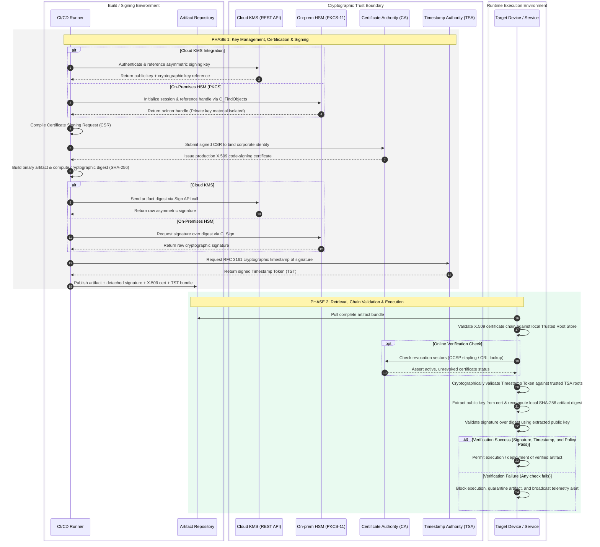
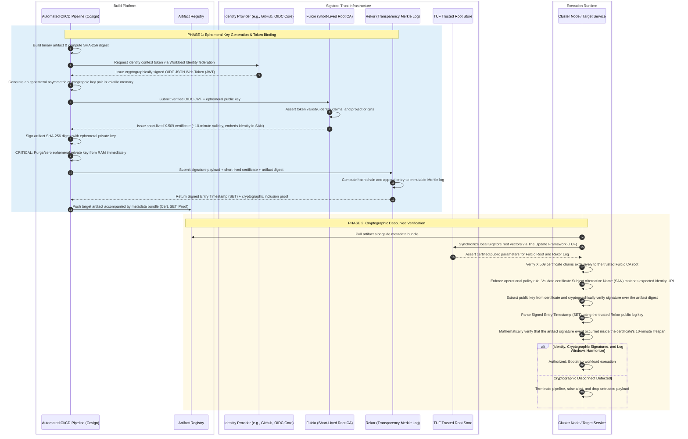
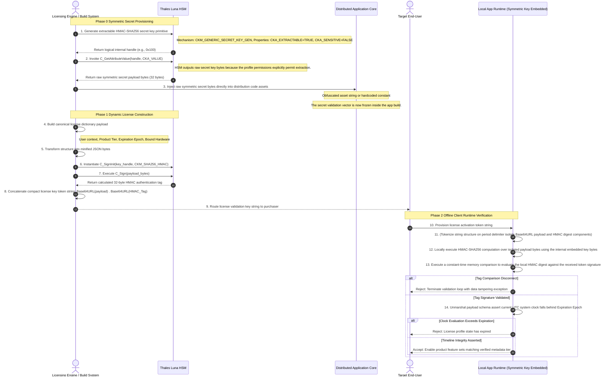
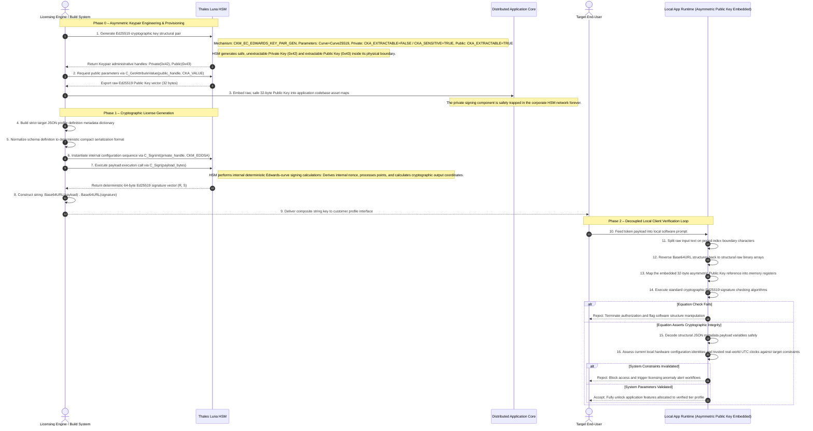
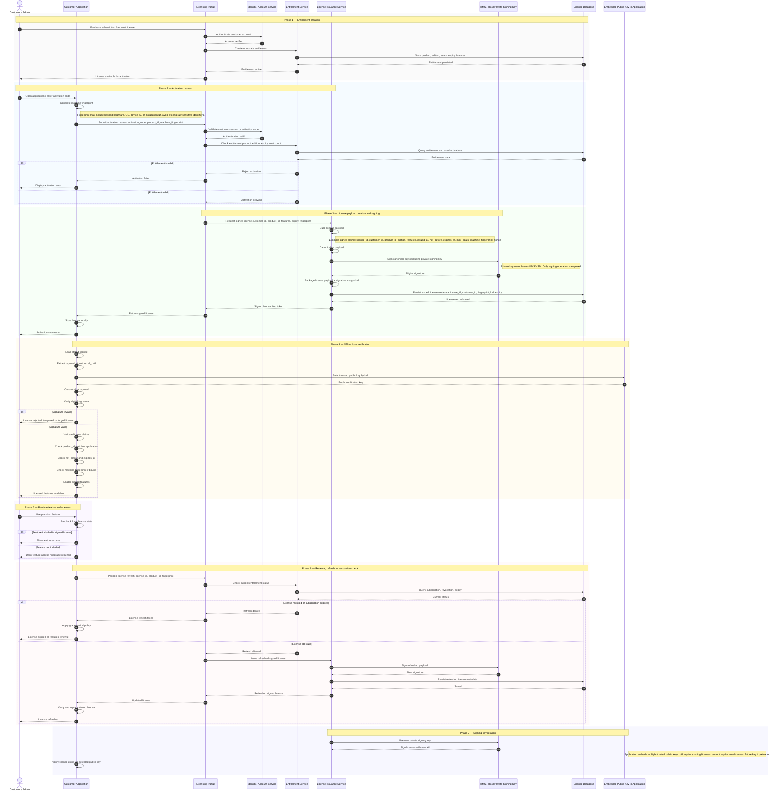

# Cryptography Guidance

- [1. Category](#1-category)
  - [1.1. Public Key Infrastructure (PKI)](#11-public-key-infrastructure-pki)
    - [1.1.1. Internal PKI](#111-internal-pki)
  - [1.2. Digital Signatures](#12-digital-signatures)
    - [1.2.1. Signing and Verification](#121-signing-and-verification)
      - [1.2.1.1. Traditional Key Management](#1211-traditional-key-management)
      - [1.2.1.2. Keyless Management](#1212-keyless-management)
    - [1.2.2. License Key Systems](#122-license-key-systems)
      - [1.2.2.1. Symmetric HMAC‑Based License Keys](#1221-symmetric-hmacbased-license-keys)
      - [1.2.2.2. Asymmetric Ed25519‑Based License Key](#1222-asymmetric-ed25519based-license-key)
    - [1.2.3. Secure Boot](#123-secure-boot)
  - [1.3. Key Management](#13-key-management)
    - [1.3.1. Digital License Signatures](#131-digital-license-signatures)
  - [1.4. Transport Layer Security (TLS)](#14-transport-layer-security-tls)
    - [1.4.1. TLS 1.2](#141-tls-12)
    - [1.4.2. TLS 1.3](#142-tls-13)
    - [1.4.3. Mutual TLS (mTLS)](#143-mutual-tls-mtls)
    - [1.4.4. TLS Pre-Shared Key (TLS-PSK)](#144-tls-pre-shared-key-tls-psk)
- [2. References](#2-references)

## 1. Category

### 1.1. Public Key Infrastructure (PKI)

Public Key Infrastructure (PKI) is a comprehensive security framework that enables secure digital communication by combining digital certificates, asymmetric cryptography, and governing policies. It establishes identity verification, data confidentiality, message integrity, and non-repudiation across distributed systems.

1. Concepts and Components

    A robust PKI environment relies on several interdependent components working together to maintain a strict chain of trust.

    - Certificate Authority (CA)
      > The trusted entity responsible for issuing, signing, and managing digital certificates. The Root CA serves as the ultimate cryptographic anchor of trust.

    - Registration Authority (RA)
      > The vetting interface that verifies the identity of a client, device, or system requesting a certificate before the CA performs the signing operation.

    - Digital Certificates (X.509)
      > Cryptographic data structures binding a public key to an identity. Following the X.509 standard, they contain the owner's details, public key, validity boundaries, usage constraints, and the issuing CA's digital signature.

    - Certificate Revocation List (CRL) & OCSP
      > Mechanisms used to broadcast certificate invalidation before scheduled expiration. CRLs provide a periodic batch list of revoked keys, while the Online Certificate Status Protocol (OCSP) enables real-time status validation.

    - Certificate Signing Request (CSR)
      > An encoded block of text sent from an applicant to a CA. It contains the applicant's public key along with identifying information (e.g., Common Name, Subject Alternative Names) and is signed using the applicant's private key to prove possession.

2. Workflow and Process

    PKI uses public and private key pairs for encryption and authentication.

    - Key Pair Generation
      > A user or device generates a unique, mathematically linked public and private key pair. The private key is kept secret, while the public key is intended to be shared.

    - Certificate Request & Issuance
      > The public key and identifying information are sent to the RA and then the CA, which verifies the identity and issues a digital certificate signed with its own private key.

    - Secure Communication
      > When a sender wants to communicate securely, they use the recipient's public key (obtained from their certificate) to encrypt the message.

    - Decryption & Validation
      > Only the recipient's corresponding private key can decrypt the message. The recipient's system automatically validates the sender's certificate by checking the CA's signature and ensuring it hasn't expired or been revoked.

    - Digital Signatures
      > The private key is also used to create digital signatures, which verify the sender's identity and prove the data has not been tampered with in transit.

3. Diagrams

    ```mermaid
    sequenceDiagram
        autonumber
        participant C as Client (Browser)
        participant S as Server (Embedded Device/Web)
        participant CA as PKI Authority (CA)

        %% PHASE 1: PKI SETUP & KEY MANAGEMENT
        rect rgba(174, 174, 174, 0.3)
            note over S, CA: PHASE 1: PKI & Key Management (The Setup) - Occurs months/years before connection
            S->>S: Key Management: Generate Private Key & Public Key (e.g., using PKA/RSA algo)
            S->>CA: Send CSR (Public Key + Identity)
            CA->>CA: Verify Identity
            CA->>S: Issue Public Certificate
            note right of CA: This is the core of PKI: Binding Identity to a Key.
        end

        %% PHASE 2: THE HANDSHAKE (ASYMMETRIC)
        rect rgba(174, 174, 174, 0.3)
            note over C, S: PHASE 2: The Handshake (Asymmetric / PKA) - Goal: Securely create/exchange the AES Key
            C->>S: Hello (I support RSA & AES)
            S->>C: Send Public Certificate
            
            C->>C: PKI Check: Verify Cert against Trusted Root
            
            note over C: Key Management: Client generates random "Session Secret"
            
            C->>S: RSA Encrypt "Session Secret" using Server's Public Key
            note right of C: This uses PKA (RSA)
            
            S->>S: RSA Decrypt "Session Secret" using Server's Private Key
        end

        %% PHASE 3: DATA TRANSFER (SYMMETRIC)
        rect rgba(174, 174, 174, 0.3)
            note over C, S: PHASE 3: Secure Communication (Symmetric / AES) - Goal: Speed & Efficiency
            
            note over C, S: Both derive the same AES Key from the Session Secret
            
            C->>S: AES Encrypt Request (Data)
            S->>C: AES Decrypt Request -> Process -> AES Encrypt Response
            C->>S: AES Decrypt Response
        end
    ```

#### 1.1.1. Internal PKI

An **Internal PKI** establishes an isolated, private boundary of trust managed entirely within an organization to secure internal microservices, APIs, and machine-to-machine (M2M) communications.

1. Concepts and Components

    An Internal PKI system is comprised of several interdependent elements engineered to automate identity assignment while isolating the high-value root of trust.

    - Root Certificate Authority (Root CA)
      > The ultimate trust anchor for the organization. For maximum security, the Root CA is kept **completely offline** and is only booted up during highly secure "signing ceremonies" to issue or renew certificates for Intermediate CAs.

    - Intermediate Certificate Authority (Sub-CA / Issuing CA)
      > An operational engine (such as *Canonical Notary*) delegated by the Root CA to perform day-to-day certificate management. It stays online to expose APIs, evaluate issuance policies, and sign certificate requests.

    - Cryptographic Vault / HSM Backend
      > A Hardware Security Module (HSM) or specialized secret engine (e.g., *HashiCorp Vault*) integrated via PKCS#11 to securely house and isolate the Intermediate CA's private keys. The application software never sees or extracts the raw key material.

    - Registration & Policy Engine
      > Validates the incoming identity of a service account or CI/CD runner against Role-Based Access Control (RBAC) rules before allowing a certificate to be generated for a specific domain (e.g., `*.internal.company.com`).

    - Leaf Certificates
      > End-entity certificates issued automatically to microservices or devices. In automated internal environments, these are typically **short-lived** (ranging from hours to a few days), eliminating the operational dependency on heavy Certificate Revocation Lists (CRLs) or OCSP stapling.

2. The Three-Tier PKI Hierarchy

    To mitigate the catastrophic impact of a key compromise, internal deployments must utilize a **Three-Tier PKI Architecture**. This structural isolation ensures that if an online issuing component is breached, the entire organization's blast radius is contained without invalidating the root identity.

    | Tier       | Component                                      | Operational State | Cryptographic Role                         | Storage Layer                            |
    | ---------- | ---------------------------------------------- | ----------------- | ------------------------------------------ | ---------------------------------------- |
    | **Tier 1** | **Root CA**                                    | Offline           | Signs Intermediate CA Certificates         | Air-gapped Vault / Offline HSM           |
    | **Tier 2** | **Intermediate CA** *(e.g., Canonical Notary)* | Online            | Validates CSRs and Signs Leaf Certificates | HashiCorp Vault / Network HSM            |
    | **Tier 3** | **Leaf Certificates**                          | Online            | Secures Microservice mTLS / Endpoints      | Ephemeral Container Memory / Pod Storage |

3. Automated Lifecycle & Operational Workflow

    In modern containerized systems, manual certificate tracking is obsolete. Security compliance requires programmatic certificate provisioning through automated CI/CD pipelines or service mesh platform engines.

    - Root Trust Establishment
      > The offline Root CA issues a long-term intermediate signing certificate to the Intermediate CA, which binds its private key tightly inside an HSM or security backend.

    - Policy Enforcement
      > SecOps defines strict authorization boundaries via API or Web UI, dictating exactly which service identities are allowed to request certificates for specific domain namespaces.

    - Programmatic CSR Submission
      > During deployment or automated rotation, a runner or daemon generates an in-memory private key and compiles a Certificate Signing Request (CSR). The public key and service metadata are transmitted to the Intermediate CA via an authenticated HTTP API.

    - Cryptographic Verification & Return
      > The Intermediate CA intercepts the request, maps the caller's credentials to active policies, signs the payload using the protected intermediate key, and returns a short-lived X.509 leaf certificate.

    - Telemetry & Monitoring
      > Built-in observability targets (e.g., Prometheus endpoints) continuously track certificate expiration matrices and scrape telemetry data into centralized Grafana dashboards to alert on anomaly metrics before certificates expire.

4. Architectural Architecture Diagrams

    ```mermaid
    graph TD
        subgraph Tier 1: Core Root Store [Tier 1: Root Store - Offline]
            RootCA["Offline Root CA <br> (Air-Gapped Vault)"]
        end

        subgraph Tier 2: Operational Fabric [Tier 2: Issuance Fabric - Online]
            Notary["Intermediate CA <br> (Canonical Notary Engine)"]
            Vault["Secret Vault / HSM <br> (Key Isolation Layer)"]
            Policy["RBAC / Domain Policies <br> (*.internal.company.com)"]
            
            Notary <-->|Isolates & Locks Keys| Vault
            Notary --- |Enforces Access Rules| Policy
        end

        subgraph Tier 3: Workload Runtime [Tier 3: Microservice Infrastructure]
            Pipeline["CI/CD Pipeline / Runner"]
            SvcA["Microservice Alpha"]
            SvcB["Microservice Beta"]
        end

        %% Root Signing Event
        RootCA ==>|1. Signed Certificate Authority Ceremony| Notary
        
        %% Application Flow
        Pipeline -->|2. Authenticated HTTP CSR Request| Notary
        Notary -->|3. Issues Short-Lived Leaf Cert| Pipeline
        Pipeline -->|4. Deploys with Cert Bundle| SvcA
        Pipeline -->|4. Deploys with Cert Bundle| SvcB
        
        SvcA <==>|5. Secure Automated mTLS Communication| SvcB

        style RootCA fill:#f99,stroke:#333,stroke-width:2px
        style Vault fill:#fdb,stroke:#333,stroke-width:2px
        style Notary fill:#bbf,stroke:#333,stroke-width:2px
    ```

5. Detailed Sequence Flow: Automated Leaf Provisioning & Metrics Collection

    ```mermaid
    sequenceDiagram
        autonumber
        participant SecOps as SecOps / Admin
        participant Root as Offline Root CA
        participant Notary as Canonical Notary (Intermediate)
        participant Vault as HashiCorp Vault / HSM
        participant Agent as CI/CD Pipeline / Service Agent
        participant Mon as Prometheus / Grafana

        %% Phase 1: Setup
        rect rgba(240, 240, 240, 0.4)
            note over Root, Notary: Phase 1: Authority Setup (Occurs Rarely)
            SecOps->>Root: Bring Online for Ceremony
            Root->>Notary: Sign & Issue Intermediate Certificate
            Notary->>Vault: Store Private Key securely via PKCS#11/API
            SecOps->>Root: Shut Down & Air-gap Root CA
        end

        %% Phase 2: Configuration
        rect rgba(230, 245, 255, 0.4)
            note over SecOps, Notary: Phase 2: Policy Administration
            SecOps->>Notary: Define Domain Constraints & RBAC Rules (e.g., Allow *.internal.company.com)
        end

        %% Phase 3: Automation Lifecycle
        rect rgba(230, 255, 230, 0.4)
            note over Agent, Vault: Phase 3: Automated On-Demand Issuance
            Agent->>Agent: Generate Ephemeral Keypair & Compile CSR
            Agent->>Notary: POST /v1/sign (Submit CSR + Identity Credentials)
            Notary->>Notary: Evaluate Request against RBAC/Domain Policy
            Notary->>Vault: Request Cryptographic Signature over CSR
            Vault-->>Notary: Return Valid Cryptographic Signature
            Notary-->>Agent: Return Valid short-lived X.509 Leaf Certificate
            Agent->>Agent: Load Certificate into Memory (Configure TLS Context)
        end

        %% Phase 4: Observability
        rect rgba(255, 245, 230, 0.4)
            note over Notary, Mon: Phase 4: Continuous Telemetry Monitoring
            Mon->>Notary: Scrape `/metrics` (Prometheus)
            Notary-->>Mon: Expose Expiration Timelines & Active Volumetrics
            note right of Mon: Grafana triggers proactive alerts if renewal loops stall.
        end
    ```

    > [!TIP]
    > **Operational Best Practice:** When moving to an automated internal architecture, configure leaf certificates with an operational lifespan of 24 to 72 hours. This eliminates complex CRL distribution caching inside highly scaled, dynamic Kubernetes topologies. If a service node is compromised, it is quarantined immediately, and its certificate automatically becomes inert within hours.

### 1.2. Digital Signatures

Digital signatures provide cryptographic verification of data authenticity, non-repudiation, and structural integrity.

#### 1.2.1. Signing and Verification

##### 1.2.1.1. Traditional Key Management

Traditional code and artifact signing relies on persistent asymmetric key pairs anchored to long-lived X.509 code-signing certificates. Private keys must be physically or logically isolated inside dedicated secure enclaves to prevent extraction or abuse.



##### 1.2.1.2. Keyless Management

Keyless signing eliminates long-lived private keys and traditional corporate certificate management. Short-lived certificates are bound to identities authenticated via OpenID Connect (OIDC), recording signatures in an public append-only cryptographic transparency log.



#### 1.2.2. License Key Systems

##### 1.2.2.1. Symmetric HMAC‑Based License Keys

HMAC (Hash-based Message Authentication Code) is a symmetric key cryptographic algorithm that combines a secret key with a cryptographic hash function (e.g., SHA-256). In a licensing framework, HMAC strings protect structural attributes from client-side tampering, but carry distinct operational risks if deployed insecurely.

> [!NOTE]
> Asymmetric signature architectures (such as Ed25519) should always be favored over symmetric architectures for distributed offline validation engines.

> [!WARNING]
> Symmetric HMAC-based licensing models require the absolute isolation of the signing secret. Since the exact same secret key is utilized to both generate and verify the payload, exposing the verification key undermines the security of the entire scheme.

> [!CAUTION]
> Hardcoding or obfuscating the symmetric HMAC key inside a distributed application client breaks the protective perimeter of an HSM. A malicious party running standard reverse-engineering binaries can isolate, extract, and manipulate the raw symmetric secret key bytes to synthesize valid, forged licenses.



##### 1.2.2.2. Asymmetric Ed25519‑Based License Key

Ed25519 is an elliptic curve signature scheme using the EdDSA framework over Curve25519. It offers excellent performance overhead profiles and high side-channel attack resilience while outputting ultra-compact signatures (64 bytes) and public keys (32 bytes). This model ensures that exposing the client validation bundle does not threaten the signature generation core.



1. Architectural Principles and Verification Math

    - Key Generation
      > The generation client instructs the HSM to provision an active Ed25519 signature keypair using the `CKM_EC_EDWARDS_KEY_PAIR_GEN` mechanism. Setting `CKA_EXTRACTABLE=FALSE` ensures the private key structure remains physically isolated within the hardware boundary.

    - Public Key Extraction
      > The corresponding 32-byte asymmetric public key is safely read and widely distributed, as it provides zero computational leverage for calculating the original private key.

    - Signing Mechanism
      > Ed25519 uses SHA-512 internally to derive nonces deterministically from the private key and message content, avoiding security flaws caused by poorly configured external random number generators (RNGs).

    - Asymmetric Verification Math
      > The application client validates signatures offline using the embedded public key vector ($A$), the message payload ($M$), and the signature coordinates ($R, S$). It performs scalar multiplication over the elliptic curve base point ($B$) to confirm:

      $$S \cdot B = R + H(R \parallel A \parallel M) \cdot A$$

      > [!NOTE]
      > Because this is an asymmetric calculation, a malicious party reverse-engineering the binary can only extract the public validation key ($A$), making license forgery mathematically impossible without access to the offline HSM.

#### 1.2.3. Secure Boot

Secure Boot is a fundamental cryptographic safety architecture designed to guarantee that an electronic asset boots using only software validated and trusted by either the Original Equipment Manufacturer (OEM) or the system administrator. By establishing a rigid, verified validation sequence at every stage of the boot cycle, Secure Boot effectively blocks rootkits, bootkits, and malicious firmware manipulation before the underlying operating system takes control.

1. Concepts and Keys (UEFI Security Model)

    Establishing a cryptographically immutable boot flow requires a standardized database hierarchy stored in non-volatile, secure variables (e.g., Motherboard NVRAM or EFIVARS).

    - Hardware Root of Trust (RoT)
      > An immutable, read-only block of code or public key hash embedded directly within the physical processor or system-on-chip (SoC) boot ROM during semiconductor fabrication. It forms the unforgeable base anchor for all subsequent code validation.

    - Platform Key (PK)
      > The pinnacle key of the operational hierarchy (typically an asymmetric RSA-2048 or ECDSA P-256 pair) owned and deployed by the hardware platform owner. The PK enforces absolute control over who can update or modify the Key Exchange Key (KEK) database.

    - Key Exchange Key (KEK)
      > A collection of public keys or X.509 certificates used to establish a relationship between the platform firmware and operating systems. Only payloads signed by an active KEK can modify the downstream signature whitelist (`db`) or blacklist (`dbx`).

    - Signature Whitelist Database (db)
      > A secure repository containing public keys, certificates, or SHA-256 hashes of recognized, authenticated boot components. Any executable firmware driver, Option ROM, or operating system bootloader must match an active certificate or hash within this database to be permitted to run.

    - Revocation Blacklist Database (dbx)
      > A structural blacklist housing the hashes and certificates of revoked, vulnerable, or actively compromised boot artifacts.
      > **Strict Rule:** The `dbx` database takes absolute precedence over the whitelist. If an executable's signature is valid in `db` but its explicit binary hash or signing certificate matches an entry in `dbx`, execution is halted immediately.

2. Workflow and Chain of Trust Execution

    Secure Boot operates on a progressive verification model: **Measure and Verify Before Execution**. Each component in the boot stack must validate the cryptographic authenticity of the subsequent component before passing off CPU control.

    - Step 1: Power On & Hardware Reset
      > The physical CPU releases from reset and directly invokes the immutable Hardware Root of Trust (RoT) from internal ROM. This ROM measures and verifies the signature of the primary stage boot firmware (UEFI/BIOS images) against embedded hardware keys.

    - Step 2: Driver & Environment Initialization
      > As the UEFI environment starts up, it reads the option ROMs of peripheral components (e.g., PCIe controllers, storage arrays, GPU firmware). Each discrete driver binary is validated against the NVRAM `db` and cross-referenced with `dbx` rules.

    - Step 3: Bootloader Handoff
      > The firmware targets the designated boot media to invoke the OS bootloader (such as `shim.efi` or `GRUB`). The firmware verifies the binary's integrated Authenticode signature. If compliant, the bootloader is loaded into memory.

    - Step 4: Kernel Execution & Module Enforcement
      > The bootloader acts as an extension of trust, reading the operating system kernel image (e.g., `vmlinuz`). It checks the kernel signature using trusted keys passed down or integrated into the platform environment. Once verified, the kernel initializes and blocks the loading of unsigned third-party kernel modules (`.ko`) or compromised hardware drivers.

3. Architecture Diagram

    ```mermaid
    graph TD
        A[Power On / Platform Reset] --> B[Execute Immutable Boot ROM / RoT]
        B --> C{Verify UEFI Core <br> Firmwares?}

        C -- Verification Failed --> X[Halt Boot Execution / Trigger Alert]
        C -- Cryptographically Valid --> D[Initialize UEFI Environment]

        D --> E{Verify Bootloader / Shim <br> against db & dbx}
        E -- Blacklisted in dbx / Missing db --> X
        E -- Verified in db whitelist --> F[Execute Bootloader]

        F --> G{Verify Operating System <br> Kernel Signature?}
        G -- Tampered / Untrusted Kernel --> X
        G -- Signature Confirmed --> H[Initialize OS Kernel]

        H --> I{Runtime Module Load: <br> Evaluate Module Signatures}
        I -- Unsigned Module Detected --> J[Block Module Initialization]
        I -- Signed Module Validated --> K[System Reaches Protected User Space Runtime]

        style A fill:#f2f2f2,stroke:#333,stroke-width:1px
        style X fill:#ff9999,stroke:#cc0000,stroke-width:2px
        style K fill:#99ff99,stroke:#00cc00,stroke-width:2px
        style J fill:#fdb,stroke:#333,stroke-width:1px
    ```

4. Key DB Modification Rules

    To prevent malicious modification of the internal NVRAM tables, variable updates must adhere to the following logic matrix.

    | Target Database Variable   | Modifying Key Authority Requirement         | Common Industry Application                                                                  |
    | -------------------------- | ------------------------------------------- | -------------------------------------------------------------------------------------------- |
    | **Platform Key (PK)**      | Self-signed with the existing **PK**        | Revoking current platform ownership or rotating vendor roots.                                |
    | **Key Exchange Key (KEK)** | Signed with the active **PK**               | OEMs adding operating system distributors (e.g., Microsoft or Red Hat keys).                 |
    | **Signature DB (db)**      | Signed with an authorized **KEK** or **PK** | Operating systems updating local validation keys or enterprise-specific boot tokens.         |
    | **Revocation DB (dbx)**    | Signed with an authorized **KEK** or **PK** | Global security updates pushing revocations for newly discovered bootloader vulnerabilities. |

### 1.3. Key Management

#### 1.3.1. Digital License Signatures



### 1.4. Transport Layer Security (TLS)

#### 1.4.1. TLS 1.2

1. Cipher Suites

    The TLS 1.2 cipher suite naming convention explicitly defines the key exchange, signature, bulk encryption, and hashing algorithms used for the session.

    ```plaintext
    Format:  <protocol>_<key-exchange>_<signature>_WITH_<bulk-encryption>_<hash>
    Example: TLS_ECDHE_ECDSA_WITH_AES_128_GCM_SHA256
    ```

2. Standard Handshake Diagram (One-Way Authentication)

    ```mermaid
    ---
    title: TLS 1.2 Standard 1-Way Handshake
    ---
    sequenceDiagram
      autonumber
      participant Client
      participant Server

      note over Client,Server: TCP Handshake (SYN -> SYN/ACK -> ACK)

      rect rgba(174, 174, 174, 0.1)
        note over Client,Server: Asymmetric Phase (Negotiation & Authentication)
        Client->>Server: ClientHello (TLS v1.2, Client Random, Supported CipherSuites)
        Server->>Client: ServerHello (Selected CipherSuite, Server Random)
        Server->>Client: ServerCertificate (X.509 Certificate Chain)
        Server-->>Client: ServerKeyExchange (Ephemeral DH parameters)
        Server->>Client: ServerHelloDone
      end

      rect rgba(174, 174, 174, 0.2)
        note over Client,Server: Key Exchange & Verification
        Client->>Client: Validate Server Certificate against Root Store
        Client->>Server: ClientKeyExchange (Public Key / Pre-master secret)
        Client->>Client: Derive Master Secret (via Client/Server Random + Pre-master)
        Server->>Server: Derive Master Secret (via Client/Server Random + Pre-master)
      end

      rect rgba(174, 174, 174, 0.3)
        note over Client,Server: Symmetric Phase (Encryption Activated)
        Client->>Server: ChangeCipherSpec (Switching to symmetric encryption)
        Client->>Server: Finished (Encrypted verification payload)
        Server->>Client: ChangeCipherSpec
        Server->>Client: Finished
      end

      loop Secure Data Exchange
        Client->>Server: Encrypted Application Data (Symmetric Key)
        Server->>Client: Encrypted Application Data (Symmetric Key)
      end
    ```

#### 1.4.2. TLS 1.3

TLS 1.3 slashes handshake latency from 2-RTT to **1-RTT** by radically removing legacy key exchange mechanisms (such as static RSA and custom DH groups) in favor of mandatory ephemeral Diffie-Hellman (ECDHE/DHE).

1. Cipher Suites

    Cipher suites in TLS 1.3 are drastically simplified because the key exchange and certificate signature algorithms are negotiated via independent extensions, leaving the cipher suite to define only the symmetric encryption and HKDF hash algorithm.

    ```plaintext
    Format:  <protocol>_<bulk-encryption>_<hash>
    Example: TLS_AES_256_GCM_SHA384
            TLS_CHACHA20_POLY1305_SHA256
    ```

2. Handshake Diagram (1-RTT)

    ```mermaid
    ---
    title: TLS 1.3 Standard 1-RTT Handshake
    ---
    sequenceDiagram
      autonumber
      participant Client
      participant Server

      rect rgba(0, 150, 255, 0.1)
        note over Client,Server: 1-RTT Asymmetric & Key Generation Phase
        Client->>Server: ClientHello (CipherSuites, KeyShare Guess [ECDHE parameters], Client Random)
        note over Server: Server computes shared secret immediately using Client KeyShare
        Server->>Client: ServerHello (Chosen CipherSuite, Server KeyShare, Server Random)
      end

      rect rgba(0, 150, 255, 0.2)
        note over Server: Server encrypts downstream handshake flights
        Server->>Client: EncryptedExtensions
        Server->>Client: Certificate
        Server->>Client: CertificateVerify (Signature over handshake transcripts)
        Server->>Client: Finished
      end

      rect rgba(0, 150, 255, 0.3)
        note over Client: Client derives secret, verifies certificate, and transcript signature
        Client->>Server: Finished
      end

      loop Symmetric Communication
        Client->>Server: Encrypted Application Data
        Server->>Client: Encrypted Application Data
      end
    ```

#### 1.4.3. Mutual TLS (mTLS)

Mutual TLS (mTLS) enforces **two-way peer authentication**. In addition to the client validating the server's identity, the server requests, parses, and cryptographically validates the client’s X.509 certificate against an authorized client root/intermediate CA store.

> [!IMPORTANT]
> mTLS is a cornerstone of Zero Trust Architectures, establishing cryptographically unforgeable machine-to-machine (M2M) identity verification independent of application layer logic.

1. Architectural Workflow

    - Server Identity Proof
      > The server transmits its certificate chain; the client verifies it against local trust roots.

    - Client Certificate Request
      > The server explicitly issues a `CertificateRequest` flight containing an acceptable list of CA Distinguished Names.

    - Possession Proof
      > The client returns its certificate and generates a `CertificateVerify` signature. This signature signs all previous handshake messages using the client’s **private key**, proving ownership of the public key hosted in the certificate.

2. Handshake Diagram (TLS 1.3 Context)

    ```mermaid
    ---
    title: Mutual TLS (mTLS) in TLS 1.3
    ---
    sequenceDiagram
      autonumber
      participant Client
      participant Server

      Client->>Server: ClientHello (Supported Suites, KeyShare Guess)
      Server->>Client: ServerHello (Selected Suite & KeyShare)

      rect rgba(46, 204, 113, 0.1)
        note over Server: Server prepares encrypted handshake details
        Server->>Client: EncryptedExtensions
        Server->>Client: CertificateRequest (Asks for Client X.509 Identification)
        Server->>Client: Server Certificate
        Server->>Client: CertificateVerify (Server transcript signature)
        Server->>Client: Finished
      end

      rect rgba(46, 204, 113, 0.2)
        note over Client: Client verifies server credentials
        Client->>Client: Validate Server Cert Chain

        note over Client: Client sends identity & cryptographic signature proof
        Client->>Server: Client Certificate (X.509)
        Client->>Server: CertificateVerify (Client signs transcript with Private Key)
        Client->>Server: Finished
      end

      rect rgba(46, 204, 113, 0.3)
        note over Server: Server validates client identity
        Server->>Server: Validate Client Cert against Trusted Client Root CA
        Server->>Server: Verify Client Transcript Signature with Cert Public Key
      end

      loop Symmetric Communication (Mutual Trust Established)
        Client->>Server: Bi-directionally Authenticated Data
        Server->>Client: Bi-directionally Authenticated Data
      end
    ```

#### 1.4.4. TLS Pre-Shared Key (TLS-PSK)

TLS Pre-Shared Key (TLS-PSK) configurations bypass asymmetric infrastructure (CAs, X.509 certificates, CRL lookup) by relying on a symmetric cryptographic secret pre-distributed and securely stored out-of-band by both endpoints.

> [!NOTE]
> Highly optimized for constrained embedded controllers, IoT hardware, and high-performance backend routing fabrics where asymmetric compute overhead (RSA/ECDSA calculations) or PKI management is logistically impossible.

1. Types of PSK Configurations

    - External PSK
      > Symmetric keys preconfigured statically out-of-band (e.g., flashed onto an IoT endpoint during factory manufacturing).

    - Resumption PSK
      > Established dynamically during a prior full TLS 1.3 handshake session via a New Session Ticket (NST) frame, enabling fast **0-RTT resumption connections**.

2. Handshake Diagram (External PSK Mode - TLS 1.3)

    ```mermaid
    ---
    title: TLS 1.3 External PSK Handshake
    ---
    sequenceDiagram
      autonumber
      participant Client
      participant Server

      note over Client,Server: Out-of-Band Setup: Secret PSK & Identity String shared beforehand.

      rect rgba(243, 156, 18, 0.1)
        note over Client: Client constructs key derivation path
        Client->>Client: Look up PSK Secret & Identity Label
        Client->>Server: ClientHello (psk_key_exchange_modes, pre_shared_key Extension [Identity Label])
      end

      rect rgba(243, 156, 18, 0.2)
        note over Server: Server correlates identity
        Server->>Server: Look up local DB for matching PSK Label
        Server->>Server: Derive Binder Key & derive master secrets from symmetric PSK
        Server->>Client: ServerHello (pre_shared_key Extension confirming matched index)
      end

      rect rgba(243, 156, 18, 0.3)
        note over Server: Server signs transcript with symmetric secret derivatives
        Server->>Client: EncryptedExtensions
        Server->>Client: Finished
      end

      rect rgba(243, 156, 18, 0.4)
        Client->>Client: Verify Server Finished tag using derived PSK secrets
        Client->>Server: Finished
      end

      loop Secure Data Exchange
        Client->>Server: Encrypted Application Data (No Asymmetric Keys Used)
        Server->>Client: Encrypted Application Data
      end
    ```

## 2. References

- IBM [Cybersecurity](https://www.ibm.com/think/cybersecurity) guide.
- IETF [TLS 1.2](https://www.ietf.org/rfc/rfc5246.txt) specification.
- IETF [TLS 1.3](https://datatracker.ietf.org/doc/html/rfc8446) specification.
- IETF [Mutual TLS](https://datatracker.ietf.org/doc/html/rfc8705) specification.
- NIST [Digital Signature Standard (DSS)](https://csrc.nist.gov/pubs/fips/186-5/final) publication.
- ETSI [Electronic Signatures and Infrastructures (ESI)](https://www.etsi.org/deliver/etsi_en/319100_319199/31910201/01.01.01_60/en_31910201v010101p.pdf) page.
- BSI [Basics of Digital Signature](https://www.bsi.bund.de/DE/Themen/Oeffentliche-Verwaltung/Moderner-Staat/ElektronischeSignatur/elektronischesignatur_node.html) page.
- NIST [Zero Trust Architecture](https://csrc.nist.gov/pubs/sp/800/207/final) publication.
