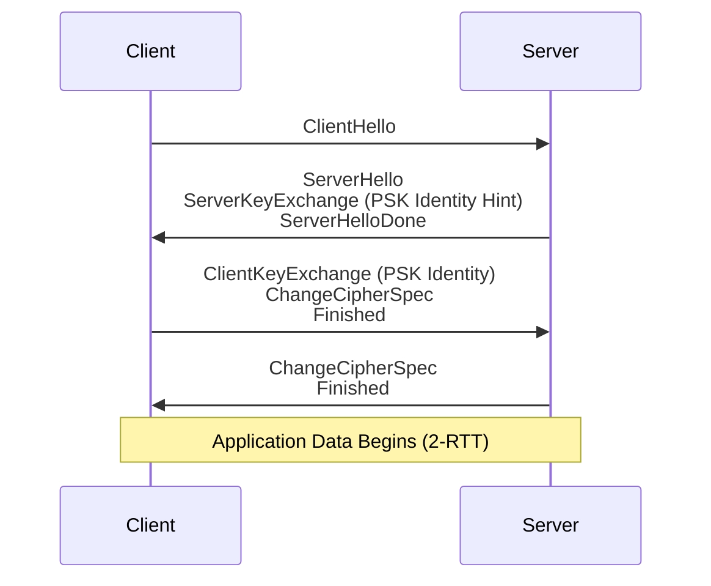
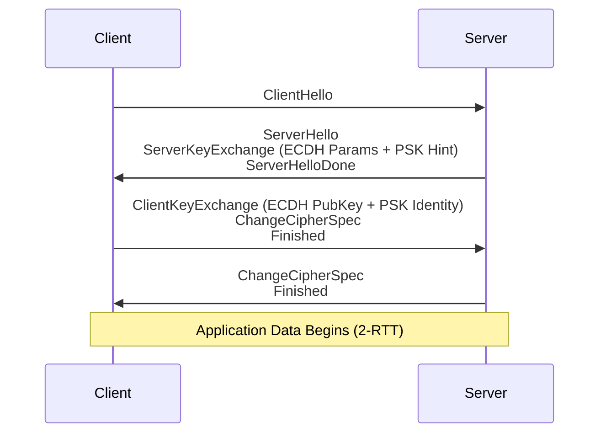
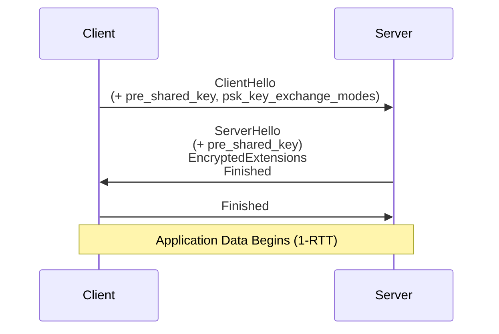
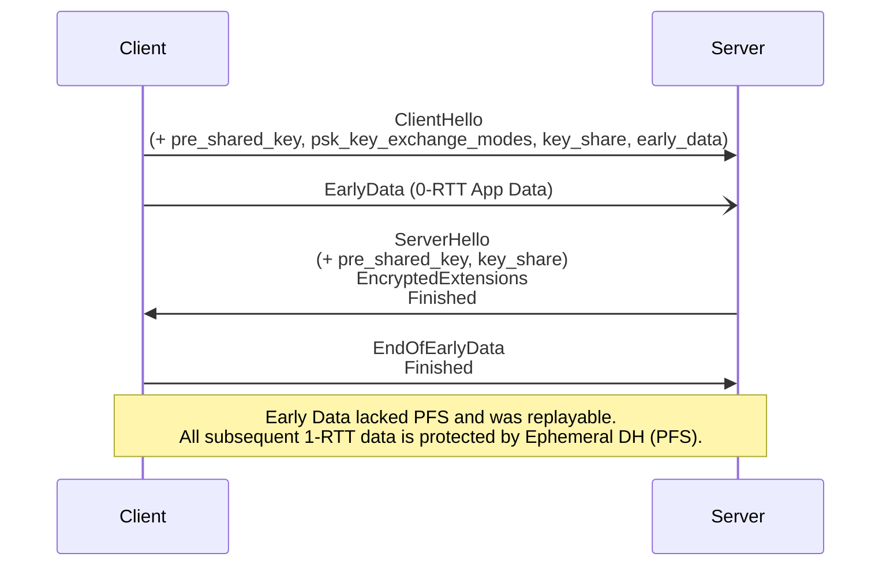
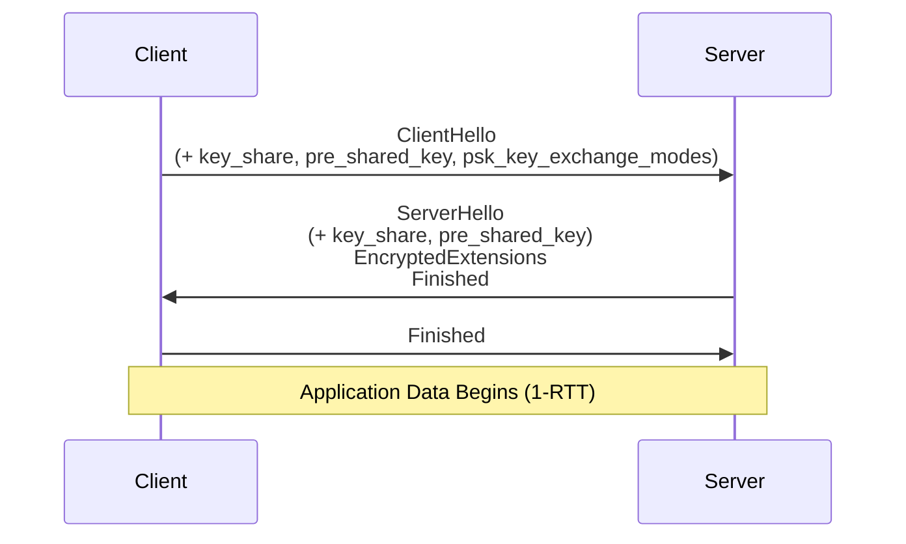

# 015-ADR: TLS-PSK

Architectural Decision Records (ADR) on selecting a TLS Pre-Shared Key (PSK) handshake mode for secure session establishment.

- [1. State](#1-state)
- [2. Context](#2-context)
- [3. Decision](#3-decision)
  - [3.1. TLS 1.3 PSK with (EC)DHE](#31-tls-13-psk-with-ecdhe)
- [4. Considered](#4-considered)
  - [4.1. TLS 1.2 PSK](#41-tls-12-psk)
  - [4.2. TLS 1.2 ECDHE-PSK](#42-tls-12-ecdhe-psk)
  - [4.3. TLS 1.3 PSK-only](#43-tls-13-psk-only)
  - [4.4. TLS 1.3 PSK with (EC)DHE and 0-RTT Early Data](#44-tls-13-psk-with-ecdhe-and-0-rtt-early-data)
  - [4.5. TLS 1.3 PSK with (EC)DHE](#45-tls-13-psk-with-ecdhe)
- [5. Consequences](#5-consequences)
- [6. Implementation](#6-implementation)
- [7. References](#7-references)

## 1. State

- Author(s): Sentenz
- Date: 2026-05-05
- Status: Proposed

## 2. Context

TLS supports PSK authentication across TLS 1.2 and TLS 1.3, but the security properties differ materially by protocol version and key-exchange mode. In TLS 1.2, the cipher suite name encodes authentication, key exchange, AEAD, and hash selection. In TLS 1.3, cipher suites only select the symmetric AEAD and hash; PSK authentication and Diffie-Hellman participation are negotiated with the `pre_shared_key` and `psk_key_exchange_modes` extensions.

This ADR evaluates legacy TLS 1.2 PSK modes for compatibility, TLS 1.3 PSK-only mode for constrained environments, TLS 1.3 DHE-PSK for forward secrecy, and TLS 1.3 0-RTT early data as a latency-optimized operational variant. All evaluated modes rely on AEAD record protection and a per-record nonce constructed by XORing the 64-bit sequence number with the static write IV (RFC 8446 §5.3). The choice introduces trade-offs across latency, forward secrecy, replay-attack exposure, implementation complexity, and operational key management.

1. Decision Drivers

    - Latency
      > Minimize the number of round trips required to establish a secure session, particularly for high-frequency or latency-sensitive connections.

    - Forward Secrecy
      > Ensure that compromise of a long-term PSK does not retroactively expose previously recorded session traffic.

    - Replay Attack Protection
      > Prevent an adversary from replaying captured messages to trigger unintended server-side processing, as described in RFC 8446 §8.

    - Nonce Uniqueness
      > Guarantee that the per-record nonce is never reused under the same AEAD key across any two sessions or records, as required by RFC 8446 §5.3.

    - Authentication Strength
      > Provide mutual endpoint authentication using a pre-shared secret in accordance with RFC 9257 guidance for external PSKs.

    - Resource Constraints
      > Support deployment on constrained devices where asymmetric-key operations (e.g., RSA, ECDSA) are prohibitively expensive.

## 3. Decision

### 3.1. TLS 1.3 PSK with (EC)DHE

TLS 1.3 PSK with (EC)DHE (`psk_dhe_ke`) is selected as the standard PSK handshake mode. In TLS 1.3, this mode uses the regular 1-RTT handshake, and the per-record nonce is a protocol inherent record-layer construction. The PSK authenticates the communicating endpoints, and the ephemeral Diffie-Hellman exchange contributes fresh key material for each session. This combination provides forward secrecy while retaining PSK-based authentication and avoiding certificate-chain validation in constrained deployments.

Application data is sent only after the TLS 1.3 Finished messages complete. The per-record nonce (sequence counter XOR static write IV, per RFC 8446 §5.3) is provided by the TLS record layer and does not require external nonce synchronization. RFC 9257 recommends `psk_dhe_ke` over `psk_ke` for external PSKs because `psk_dhe_ke` prevents later PSK disclosure from being sufficient to reconstruct past traffic keys.

1. Rationale

    - Latency
      > One round trip is required before application data is exchanged; this is acceptable for the target use cases and avoids the replay constraints imposed by 0-RTT mode.

    - Forward Secrecy
      > The ephemeral DHE key exchange combined with the PSK ensures that session keys cannot be derived from the PSK alone, protecting recorded traffic even if the PSK is later compromised.

    - Replay Attack Protection
      > Application data is sent only after the server has verified the PSK binder and transmitted its Finished message, eliminating the 0-RTT replay-attack window described in RFC 8446 §8.

    - Nonce Uniqueness
      > Per-record nonces are derived from the sequence counter XOR the static write IV (RFC 8446 §5.3); distinct session keys per connection guarantee nonce uniqueness across sessions without additional state management.

    - Authentication Strength
      > The PSK binder in the ClientHello cryptographically binds the PSK to the full handshake transcript, preventing PSK confusion and cross-protocol attacks as specified in RFC 9257.

    - Resource Constraints
      > PSK-DHE avoids certificate-based asymmetric operations; the DHE step uses lightweight elliptic-curve groups (e.g., X25519) supported by constrained TLS 1.3 implementations.

## 4. Considered

### 4.1. TLS 1.2 PSK

TLS 1.2 PSK relies on a pre-shared key for authentication and key establishment. It is lightweight and avoids certificates, but it does not provide forward secrecy: if the PSK is compromised later, recorded sessions protected by that PSK can be decrypted.

```text
TLS 1.2
+ TLS_PSK_WITH_AES_128_GCM_SHA256
+ AEAD = AES-128-GCM
+ PRF hash = SHA-256
+ Pure PSK authentication
+ RSA/DHE key exchange omitted
+ No Forward Secrecy
```



- Pros

  - Resource Constraints
    > Avoids certificate processing and asymmetric key exchange, making it inexpensive for deeply constrained devices.

  - Operational Simplicity
    > Uses a single pre-provisioned secret and a compact TLS 1.2 handshake profile.

- Cons

  - Forward Secrecy
    > Session keys are derived from the PSK without an ephemeral Diffie-Hellman contribution; later PSK compromise can expose recorded traffic.

  - Protocol Longevity
    > TLS 1.2 PSK cipher suites are legacy compatibility mechanisms and do not provide the cleaner extension-based PSK model used by TLS 1.3.

  - Authentication Strength
    > Security depends heavily on PSK entropy, uniqueness, provisioning, and storage; reuse across endpoints expands the blast radius of a single key leak.

### 4.2. TLS 1.2 ECDHE-PSK

TLS 1.2 ECDHE-PSK combines PSK authentication with an ephemeral Elliptic Curve Diffie-Hellman exchange. It provides forward secrecy relative to TLS 1.2 pure PSK, but it retains TLS 1.2 cipher-suite complexity and should be treated as a compatibility option rather than the preferred profile for new deployments.

```text
TLS 1.2
+ TLS_ECDHE_PSK_WITH_AES_128_GCM_SHA256
+ AEAD = AES-128-GCM
+ PRF hash = SHA-256
+ PSK authentication
+ Ephemeral ECDH key exchange
+ Perfect Forward Secrecy (PFS)
```



- Pros

  - Forward Secrecy
    > Ephemeral ECDH contributes fresh key material so recorded traffic is not recoverable from the PSK alone.

  - Legacy Interoperability
    > Supports peers that cannot negotiate TLS 1.3 but still require PSK-authenticated sessions with forward secrecy.

- Cons

  - Latency
    > Requires the TLS 1.2 handshake flight pattern before application data is established.

  - Implementation Complexity
    > Keeps TLS 1.2 cipher-suite-specific behaviour, PSK identity hints, and legacy handshake semantics in scope.

  - Preferred Protocol
    > TLS 1.3 DHE-PSK offers the same design intent with a simpler PSK extension model and modern key schedule.

### 4.3. TLS 1.3 PSK-only

TLS 1.3 PSK-only mode (`psk_ke`) uses the `pre_shared_key` extension and PSK binder validation. The selected TLS 1.3 cipher suite, such as `TLS_AES_128_GCM_SHA256`, defines only the AEAD and hash. No Diffie-Hellman key share is exchanged, so the session key schedule depends on the PSK and transcript but lacks forward secrecy.

```text
TLS 1.3
+ TLS_AES_128_GCM_SHA256
+ AEAD = AES-128-GCM
+ HKDF hash = SHA-256
+ pre_shared_key extension
+ psk_key_exchange_modes: psk_ke
+ PSK binder validation
+ No Forward Secrecy
```



- Pros

  - Latency
    > Completes the standard TLS 1.3 PSK handshake in one round trip without the computational cost of a Diffie-Hellman exchange.

  - Resource Constraints
    > Minimizes public-key computation and may be attractive for severely constrained devices with hardware AEAD support but limited scalar-multiplication capacity.

- Cons

  - Forward Secrecy
    > No Forward Secrecy. All traffic keys for the entire session depend solely on the static PSK. A PSK compromise can be sufficient to reconstruct traffic keys for recorded sessions because no ephemeral DH secret contributes to the key schedule. An attacker who records traffic today and steals the PSK later can completely decrypt sessions.

  - Security Margin
    > RFC 9257 recommends `psk_dhe_ke` for external PSKs, making PSK-only mode unsuitable as the default profile.

### 4.4. TLS 1.3 PSK with (EC)DHE and 0-RTT Early Data

TLS 1.3 PSK with (EC)DHE and 0-RTT Early Data utilizes the `psk_dhe_ke` exchange mode. The `ClientHello` message carries the `pre_shared_key`, `psk_key_exchange_modes`, `key_share`, and `early_data` extensions, allowing early application data and a fresh ephemeral Diffie-Hellman (DH) exchange within the same handshake. The 0-RTT early application data is encrypted using keys derived from the **Early Secret** (which depends solely on the PSK), it remains vulnerable to replay attacks and lacks Perfect Forward Secrecy (PFS). Upon receiving `ServerHello` (carrying the server's `key_share`), the TLS 1.3 key schedule immediately incorporates the ephemeral DH shared secret to derive the **Handshake Secret** and subsequently the **Master Secret**. The `Finished` messages authenticate the handshake transcript and gate the start of 1-RTT application data, which is protected by full forward secrecy.

```text
TLS 1.3
+ TLS_AES_128_GCM_SHA256
+ AEAD = AES-128-GCM
+ HKDF hash = SHA-256
+ pre_shared_key extension
+ key_share extension (for 1-RTT Forward Secrecy)
+ early_data extension
+ psk_key_exchange_modes: psk_dhe_ke
+ PSK resumption required
+ 0-RTT early application data
+ Replayable early data
+ No Forward Secrecy for 0-RTT data (PFS applies only to 1-RTT data)
```



- Pros

  - Latency
    > Reduces connection establishment to zero round trips for the early application payload, offering the lowest possible latency for selected request-response protocols.

  - Resource Constraints
    > Minimizes active wait time on constrained devices by avoiding a server-response dependency before the first payload is transmitted.

- Cons

  - Replay Attack Protection
    > Early data is inherently replayable; an adversary can retransmit captured ClientHello and early-data records to any server instance that does not maintain per-ticket anti-replay state, as detailed in RFC 8446 §8.

  - Forward Secrecy
    > Early data is encrypted under keys derived from the PSK and prior-session resumption state; the fresh DHE exchange of the new connection does not protect those records.

  - Operational Complexity
    > Safe use requires strict idempotency constraints, bounded payload handling, and server-side anti-replay controls, which are outside the default target profile.

### 4.5. TLS 1.3 PSK with (EC)DHE

TLS 1.3 PSK with (EC)DHE (`psk_dhe_ke`) binds PSK authentication to an ephemeral Diffie-Hellman exchange. Even if the PSK is exposed later, recorded traffic remains protected because past session keys also depend on ephemeral key material that is not retained.

```text
TLS 1.3
+ TLS_AES_128_GCM_SHA256
+ AEAD = AES-128-GCM
+ HKDF hash = SHA-256
+ pre_shared_key extension
+ psk_key_exchange_modes: psk_dhe_ke
+ Ephemeral Diffie-Hellman (PFS)
+ PSK binder validation
```



- Pros

  - Forward Secrecy
    > Derives session keys from both the PSK and an ephemeral DH shared secret, protecting past sessions after PSK compromise.

  - Replay Attack Protection
    > Standard 1-RTT application data is exchanged only after binder validation and Finished-message authentication.

  - Nonce Uniqueness
    > Per-record nonces are derived by the TLS 1.3 record layer from the sequence counter and static write IV; distinct traffic keys isolate nonce spaces across sessions.

  - Authentication Strength
    > The PSK binder cryptographically binds the offered PSK identity to the handshake transcript, reducing PSK confusion risk.

- Cons

  - Computational Overhead
    > The ephemeral DH exchange adds CPU and memory overhead relative to PSK-only mode.

  - Implementation Requirement
    > Both peers must support TLS 1.3 PSK authentication, `psk_dhe_ke`, and compatible key-share groups such as X25519 or secp256r1.

## 5. Consequences

- Positive

  - Forward Secrecy
    > Session traffic remains confidential even if the long-term PSK is later exposed, reducing the blast radius of a key-compromise event.

  - Simplified Nonce Management
    > The per-record nonce is derived automatically from the sequence counter and the session-specific write IV; no external nonce state needs to be synchronized between parties.

  - Reduced Attack Surface
    > Eliminating 0-RTT early data removes the replay-attack class described in RFC 8446 §8, simplifying server-side anti-replay logic.

  - Modern PSK Semantics
    > TLS 1.3 separates cipher-suite selection from key-exchange mode selection, making the selected PSK-DHE profile clearer than TLS 1.2 cipher-suite-specific negotiation.

- Negative

  - Increased Latency
    > 1-RTT mode requires one additional round trip compared to 0-RTT, which may be unacceptable for ultra-low-latency applications or severely constrained radio environments.

  - DHE Overhead
    > The ephemeral DH key generation in `psk_dhe_ke` mode increases CPU and memory usage relative to PSK-only (`psk_ke`) mode, which may be significant on deeply constrained devices.

- Risks

  - PSK Compromise
    > If the pre-shared key is leaked through insecure provisioning or storage, all sessions authenticated by that PSK are compromised. Mitigation: enforce secure out-of-band PSK provisioning, rotate PSKs regularly, and use distinct PSKs per device pair as recommended by RFC 9257.

  - PSK Reuse Across Contexts
    > Reusing the same PSK across multiple endpoints or hash algorithms may enable cross-protocol attacks. Mitigation: follow RFC 9257 guidance to bind each external PSK to a single TLS hash algorithm and assign a unique PSK identity per communicating endpoint pair.

  - Legacy Downgrade
    > Permitting TLS 1.2 PSK compatibility can unintentionally reintroduce weaker negotiation paths. Mitigation: disable TLS 1.2 PSK by default and allow it only through an explicit compatibility profile with telemetry and sunset criteria.

## 6. Implementation

1. PSK Generation

    Generate each external PSK using a cryptographically secure pseudo-random number generator (CSPRNG) with at least 128 bits of entropy as recommended by RFC 9257 §4. Assign a globally unique PSK identity per communicating endpoint pair and bind each PSK to a single TLS hash algorithm (e.g., SHA-256) to prevent cross-protocol confusion.

2. PSK Provisioning

    Inject PSKs at device manufacturing time via a dedicated secure programming station connected over a physically protected interface (e.g., JTAG/SWD or UART with a write-once OTP lock). Provision each device with a device-unique PSK to limit the blast radius of any single key compromise, and record the PSK identity-to-device mapping in a secured key-management database.

3. PSK Exchange

    For devices that cannot receive PSKs at the factory, establish a one-time secure bootstrap session to deliver the PSK: authenticate the provisioning server using a certificate-based TLS handshake or a hardware-rooted attestation protocol, transfer the PSK over the protected channel, and disable or lock the bootstrap interface after the device confirms successful receipt. Never transmit PSKs over unauthenticated or unencrypted channels.

4. PSK Storage

    Persist PSKs in tamper-resistant, hardware-backed storage. Prefer a dedicated secure element (e.g., Microchip ATECC608, NXP SE050) or a Trusted Execution Environment (e.g., ARM TrustZone with OP-TEE) that exposes a use-key interface without permitting key export. On devices without a secure element, store the PSK in an OTP-locked or read-protected flash region and restrict access using the Memory Protection Unit (MPU) so that only the TLS stack execution context can read the key material.

5. Configure PSK Mode

    Configure the TLS 1.3 stack to advertise only `psk_dhe_ke` in the `psk_key_exchange_modes` extension of the ClientHello, disabling `psk_ke` (PSK-only without DHE) to enforce forward secrecy on all PSK-authenticated sessions.

6. Configure Cipher Suites

    Prefer TLS 1.3 cipher suites such as `TLS_AES_128_GCM_SHA256` or `TLS_AES_256_GCM_SHA384`. Do not configure TLS 1.2 PSK cipher suites unless a documented compatibility requirement exists; when compatibility is required, prefer ECDHE-PSK over pure PSK and define a deprecation path.

7. Nonce Derivation

    Rely on the TLS 1.3 record-layer nonce construction defined in RFC 8446 §5.3: pad the 64-bit sequence number to the IV length and XOR it with the static write IV derived during the handshake. Do not implement custom nonce logic outside of the TLS stack.

8. Disable 0-RTT

    Disable 0-RTT early data at the server configuration level unless a bounded, idempotent use case with server-side anti-replay state (per RFC 8446 §8) explicitly justifies its activation.

9. PSK Rotation

    Define a rotation policy that bounds PSK lifetime by time or connection count. Deliver the replacement PSK via the same secure channel used for initial provisioning, write it alongside the active PSK in protected storage, and atomically promote the replacement only after the device confirms successful storage. Revoke and securely erase the superseded PSK immediately after promotion.

10. Validate

    Verify that all TLS sessions use `psk_dhe_ke` by inspecting captured handshakes with a TLS 1.3-capable analyser (e.g., Wireshark with a TLS secrets log file) and confirm that a `key_share` extension is present in both ClientHello and ServerHello. Additionally, verify that PSK storage satisfies the hardware security requirements by reviewing the secure element or TEE integration test results.

## 7. References

- IETF [RFC 9257 – Guidance for External PSK Usage in TLS](https://www.rfc-editor.org/rfc/rfc9257.html) standard.
- IETF [RFC 8446 – TLS 1.3](https://www.rfc-editor.org/rfc/rfc8446) standard.
- IETF [RFC 4279 – Pre-Shared Key Cipher Suites for TLS](https://www.rfc-editor.org/rfc/rfc4279) standard.
- IETF [RFC 5487 – Pre-Shared Key Cipher Suites for TLS with SHA-256/384 and AES-GCM](https://www.rfc-editor.org/rfc/rfc5487) standard.
- IETF [RFC 5489 – ECDHE_PSK Cipher Suites for TLS](https://www.rfc-editor.org/rfc/rfc5489) standard.
- IETF [RFC 8442 – ECDHE_PSK Cipher Suites for TLS 1.2 and DTLS 1.2 with AES-GCM and AES-CCM](https://www.rfc-editor.org/rfc/rfc8442) standard.
- IANA [TLS Parameters](https://www.iana.org/assignments/tls-parameters/tls-parameters.xhtml) registry.
