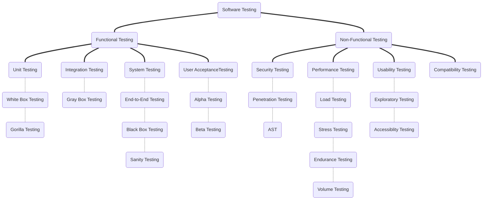

# Software Testing

Software testing is a process of evaluating the functionality of a software application or system to identify any defects, bugs, vulnerabilities or issues that may impact the functionality or performance of the software. Software testing ensure that the software meets the specified requirements and specifications, and that it performs as expected in a variety of different conditions.

- [1. Functional Testing](#1-functional-testing)
- [2. Non-Functional Testing](#2-non-functional-testing)
- [3. System Testing](#3-system-testing)
- [4. Integration Testing](#4-integration-testing)
- [5. Unit Testing](#5-unit-testing)
- [6. Regression Testing](#6-regression-testing)
- [7. End-to-End Testing](#7-end-to-end-testing)
- [8. Acceptance Testing](#8-acceptance-testing)
- [9. User Acceptance Testing](#9-user-acceptance-testing)
- [10. Performance Testing](#10-performance-testing)
- [11. Security Testing](#11-security-testing)
- [12. Usability Testing](#12-usability-testing)
- [13. Cross-Browser Testing](#13-cross-browser-testing)
- [14. Compatibility Testing](#14-compatibility-testing)
- [15. Accessibility Testing](#15-accessibility-testing)
- [16. Sanity Testing](#16-sanity-testing)
- [17. Smoke Testing](#17-smoke-testing)
- [18. Exploratory Testing](#18-exploratory-testing)
- [19. Black Box Testing](#19-black-box-testing)
- [20. White Box Testing](#20-white-box-testing)
- [21. Gray Box Testing](#21-gray-box-testing)
- [22. Beta Testing](#22-beta-testing)
- [23. A/B Testing](#23-ab-testing)
- [24. Load Testing](#24-load-testing)
- [25. Stress Testing](#25-stress-testing)
- [26. Volume Testing](#26-volume-testing)
- [27. Virtual Testing](#27-virtual-testing)
- [28. Endurance Testing](#28-endurance-testing)
- [29. Mobile Testing](#29-mobile-testing)
- [30. Database Testing](#30-database-testing)
- [31. API Testing](#31-api-testing)
- [32. Web Services Testing](#32-web-services-testing)
- [33. Network Testing](#33-network-testing)
- [34. Ad-hoc Testing](#34-ad-hoc-testing)
- [35. Continuous Testing](#35-continuous-testing)
- [36. Monkey Testing](#36-monkey-testing)
- [37. Fuzz Testing](#37-fuzz-testing)
- [38. Localization Testing](#38-localization-testing)
- [39. Internationalization Testing](#39-internationalization-testing)
- [40. Shift-Left Testing](#40-shift-left-testing)
- [41. Application Security Testing](#41-application-security-testing)
  - [41.1. Static Application Security Testing](#411-static-application-security-testing)
  - [41.2. Dynamic Application Security Testing](#412-dynamic-application-security-testing)
  - [41.3. Interactive Application Security Testing](#413-interactive-application-security-testing)
  - [41.4. Mobile Application Security Testing](#414-mobile-application-security-testing)
- [42. Test-Driven Development](#42-test-driven-development)
  - [42.1. Test Double](#421-test-double)
  - [42.2. Mock](#422-mock)
  - [42.3. Test Fixtures](#423-test-fixtures)
- [43. Behavior-Driven Development](#43-behavior-driven-development)
- [44. Acceptance Test-Driven Development](#44-acceptance-test-driven-development)
- [45. Code Coverage](#45-code-coverage)

## 1. Functional Testing

Functional testing focuses on verifying if the software works according to the specified requirements and functional specifications. It includes testing the software's functionality, data validation, and error handling.

## 2. Non-Functional Testing

Non-Functional testing focuses on evaluating the software's quality attributes such as performance, security, usability, and compatibility. It is a critical aspect of software testing as it ensures that the software works as expected under different loads and conditions.

## 3. System Testing

System testing is a comprehensive evaluation of the software system as a whole, which includes its hardware and software components. The aim of system testing is to verify that the system works as expected and meets the requirements of the stakeholders.

## 4. Integration Testing

Integration testing focuses on verifying the interactions between the software components and ensuring they work together as a system. It is a critical stage of software development, as it identifies any issues with the integration of software components.

## 5. Unit Testing

Unit testing focuses on testing individual components of the software, such as classes or functions, to ensure that they work as expected. This type of testing is performed during the development phase and is an important part of the software development process.

## 6. Regression Testing

Regression testing is a type of testing performed to ensure that changes made to the software do not introduce new defects or issues. It involves retesting the software after changes have been made to ensure that the software remains stable and functioning as expected.

## 7. End-to-End Testing

End-to-end testing is a type of testing that focuses on evaluating the complete flow of the software, from start to finish. It helps ensure that the software is functioning as expected, and that there are no issues or defects in the software.

## 8. Acceptance Testing

Acceptance testing is a type of testing that focuses on evaluating the software to determine if it meets the requirements and specifications set forth by the customer or stakeholders. It is performed to ensure that the software is ready for release or deployment.

## 9. User Acceptance Testing

User Acceptance Testing (UAT) is a type of testing performed by end-users to ensure that the software meets their requirements and expectations. UAT is performed after the software has been developed and integrated, and is the final step before the software is released to the market.

## 10. Performance Testing

Performance testing is a type of testing that focuses on evaluating the software's performance under different loads and conditions.  It helps identify any performance or scalability issues in the software, and helps ensure that the software is performing optimally.

## 11. Security Testing

Security testing is a type of testing that focuses on evaluating the software's security and identifying potential vulnerabilities. It helps ensure that the software is secure from potential threats, such as hacking or data breaches, and that sensitive data is protected.

Types of Security Testing:

- Vulnerability Scanning
  > Automates the process of identifying known security vulnerabilities in the application.

- Network Security Testing
  > Network security testing is a type of testing that focuses on identifying vulnerabilities in the network infrastructure. It includes testing firewalls, routers, and other network devices to identify potential vulnerabilities.

- Social Engineering Testing
  > Simulates social engineering attacks, such as phishing and baiting, to identify vulnerabilities in the application and the users.

## 12. Usability Testing

Usability testing is a type of testing that focuses on evaluating the user experience of the software. It helps ensure that the software is user-friendly, intuitive to navigate, and accessible to all users.

## 13. Cross-Browser Testing

Cross-browser testing is a type of testing that focuses on evaluating the software's compatibility with different web browsers. It helps ensure that the software is accessible and usable on a variety of web browsers, and that there are no compatibility issues.

## 14. Compatibility Testing

Compatibility testing is a type of testing that focuses on evaluating the software's compatibility with different operating systems, hardware, browsers, and software configurations. It helps ensure that the software is accessible and usable on a variety of platforms, and that there are no compatibility issues.

## 15. Accessibility Testing

Accessibility testing is a type of testing that focuses on evaluating the software's compatibility with assistive technologies and devices. It helps ensure that the software is accessible and usable for individuals with disabilities, and that there are no accessibility issues, regardless of their physical or cognitive abilities.

## 16. Sanity Testing

Sanity testing is a type of testing performed after making changes to the software to ensure that the changes did not negatively impact the functionality of the software. It is a quick test performed to ensure that the software is stable before performing more comprehensive testing.

## 17. Smoke Testing

Smoke testing is a type of testing performed after making changes to the software to ensure that the changes did not negatively impact the functionality of the software. It is a quick test performed to ensure that the software is stable before performing more comprehensive testing.

## 18. Exploratory Testing

Exploratory testing is a type of testing that focuses on the discovery and investigation of software defects. It is performed by the tester in an unstructured and spontaneous manner, and allows for creative and innovative testing techniques to be used.

## 19. Black Box Testing

Black box testing is a type of testing that focuses on the functionality of the software, without considering the internal structure or implementation. It involves testing the software based on its inputs and outputs, without any knowledge of the internal code of the software.

## 20. White Box Testing

White box testing is a type of testing that focuses on the internal code, structure and implementation of the software. It involves testing the software based on the individual components, design and architecture, and helps ensure that the software is functioning as intended.

## 21. Gray Box Testing

Gray box testing is a type of testing that involves a combination of black box and white box testing. It involves testing the software based on both its inputs and outputs, as well as its internal structure and implementation.

## 22. Beta Testing

Beta testing is a type of testing performed by a select group of end-users before the software is released to the market. It helps identify any defects or issues in the software, and provides valuable feedback for future development.

## 23. A/B Testing

A/B testing is a type of testing that involves testing two different versions of the software to determine which version performs better. It is commonly used in the software development process to determine which design or feature is more effective.

## 24. Load Testing

Load testing is a type of testing that focuses on evaluating the software's performance and stability under heavy loads and high traffic. It helps identify any performance or scalability issues under these conditions, and helps ensure that the software can handle the expected traffic.

## 25. Stress Testing

Stress testing is a type of testing that focuses on evaluating the software's performance and stability under extreme conditions and high stress levels. It helps identify any performance, stability or limitations issues of the softwar, and helps ensure that the software can handle unexpected scenarios.

## 26. Volume Testing

Volume testing is a type of testing that focuses on evaluating the software's performance when dealing with large amounts of data. It helps identify any performance issues or limitations of the software when dealing with large amounts of data.

## 27. Virtual Testing

Virtual testing is a type of testing that involves using virtual environments or simulations to test the software. It allows for testing to be performed in a controlled and isolated environment, and helps save time and resources compared to physical testing.

## 28. Endurance Testing

Endurance testing is a type of testing that focuses on evaluating the software's performance over a long period of time. It helps identify any performance issues or limitations of the software, and helps ensure that the software remains stable and functioning as expected over time.

## 29. Mobile Testing

Mobile testing is a type of testing that focuses on evaluating the software's compatibility with mobile devices. It helps ensure that the software is accessible and usable on a variety of mobile devices, and that there are no compatibility issues.

## 30. Database Testing

Database testing is a type of testing that focuses on evaluating the software's interactions with the database. It helps ensure that the software can retrieve and store data as expected, and that the data is accurate and secure.

## 31. API Testing

API testing is a type of testing that focuses on evaluating the software's interactions with APIs. It helps ensure that the software can interact with APIs as expected, and that the APIs are accurate and secure.

## 32. Web Services Testing

Web services testing is a type of testing that focuses on evaluating the software's interactions with web services. It helps ensure that the software can interact with web services as expected, and that the web services are accurate and secure.

## 33. Network Testing

Network testing is a type of testing that focuses on evaluating the software's performance and functionality on a network. It helps ensure that the software can communicate and interact with other systems on the network, and that the network is secure and functioning as expected.

## 34. Ad-hoc Testing

Ad-hoc testing is a type of testing that is performed without any formal planning or documentation. It is performed on an as-needed basis, and can be used to quickly identify and resolve defects in the software.

## 35. Continuous Testing

Continuous testing is a type of testing that involves performing testing activities throughout the software development life cycle. It helps ensure that software is tested continuously, and that issues are identified and resolved as soon as they occur.

## 36. Monkey Testing

Monkey testing is a type of testing that involves randomly generating inputs to the software in an attempt to find defects. It is a form of stress testing, and helps identify defects that may occur in unexpected or unusual scenarios.

## 37. Fuzz Testing

Fuzz testing is a type of testing that involves sending random or malformed inputs to the software in an attempt to find defects. It helps identify any security or reliability issues that may occur in the software, and helps ensure that the software is robust and resilient.

## 38. Localization Testing

Localization testing is a type of testing that focuses on evaluating the software's compatibility with specific languages and cultural regions. It helps ensure that the software is accessible and usable for a local audience, and that there are no localization issues.

## 39. Internationalization Testing

Internationalization testing is a type of testing that focuses on evaluating the software's ability to be used in different languages and regions. It helps ensure that the software is compatible with different languages, currencies, and time zones.

## 40. Shift-Left Testing

Shift-Left Testing is a software testing approach that emphasizes the importance of performing testing activities earlier in the software development life cycle (SDLC). The goal of Shift-Left Testing is to identify and resolve defects as soon as possible, before they become major problems. This approach focuses on shifting the testing process to the left side of the SDLC, so that testing is performed earlier and more frequently, rather than just at the end of the development process.

## 41. Application Security Testing

Application Security Testing (AST) encompasses a range of security testing activities designed to identify potential vulnerabilities and security risks in software applications.

### 41.1. Static Application Security Testing

Static Application Security Testing (SAST) performs analysis of the source code, binaries, and compiled code of an application to identify potential security vulnerabilities.

### 41.2. Dynamic Application Security Testing

Dynamic Application Security Testing (DAST) performs simulation of attacks on an application to identify security vulnerabilities while the application is running.

### 41.3. Interactive Application Security Testing

Interactive Application Security Testing (IAST) is a combination of static analysis and dynamic analysis to provide a comprehensive view of the security posture of an application.

### 41.4. Mobile Application Security Testing

Mobile Application Security Testing (MAST) performs identification of security vulnerabilities in mobile applications, including data storage, network communication, and other areas specific to mobile platforms.

## 42. Test-Driven Development

Test-Driven Development (TDD) is a software development approach that emphasizes writing automated tests before writing the actual code. TDD is based on the idea that writing tests first can lead to better code quality, better design, and improved overall software development processes.

In TDD, developers first write tests for the desired functionality, and then write the actual code to make the tests pass. This process is then repeated for each new feature or requirement. The tests are used to verify that the code works as expected, and if any bugs or issues are discovered, the code is updated to resolve them.

### 42.1. Test Double

[Test Double](https://martinfowler.com/bliki/TestDouble.html) are objects that stand in for real objects during testing

Test doubles are an essential part of unit testing and are used to isolate code under test and ensure that tests are not dependent on external systems or objects. The choice of which test double to use will depend on the specific requirements of the test, the complexity of the system being tested, and the level of isolation desired.

List of common types of test doubles:

- Dummy
  > A test double that takes no action and has no impact on the test. It is used to stand in for an object that is not needed in a particular test.

- Stub
  > A test double that returns a fixed value or performs a predefined action when called. It is used to simulate the behavior of an object that would otherwise be difficult or impossible to test.

- Spy
  > A test double that records all calls to it, including arguments and return values. It is used to verify that an object is being used correctly during testing.

- Fake
  > A test double that implements the same interface as a real object but with a simplified or reduced implementation. It is used to stand in for a real object in situations where the real object's behavior is not important or relevant to the test.

- Mock
  > A test double that verifies the interactions between objects during testing. It is used to validate that objects are calling methods on other objects as expected.

### 42.2. Mock

A mock is a type of test double used in testing to simulate the behavior of real objects in a controlled environment. Mocks allow developers to isolate individual units or components of code and verify the interactions between objects during testing. They are used to validate that objects are calling methods on other objects as expected and ensure that the code is functioning correctly.

Mocks are often created using a mocking framework or library, which provides tools for creating and configuring mock objects. The use of mocks enables developers to test code in isolation, without the need for real objects or external dependencies, and helps to improve the quality and reliability of code.

Mocks can be used in combination with other test doubles, such as stubs and spies, to create a controlled and isolated testing environment. They are an essential component of Unit Testing and Test-Driven Development (TDD) and are used to verify that code is functioning as expected and to reduce the risk of bugs and defects.

### 42.3. Test Fixtures

A test fixture is a pre-configured environment used to set up a testing scenario. It provides a known state for the test to run in and allows for tests to be repeated with consistent results. A test fixture typically includes objects, data, or conditions that are required to run the test.

Test fixtures are used in testing to create a controlled and isolated environment for testing individual units or components of code. They help to ensure that tests run consistently and produce reliable results, even when the code being tested changes.

Test fixtures can be used in combination with mocks and other test doubles to simulate the behavior of real objects and to validate the behavior of code. They are an essential component of Unit Testing and Test-Driven Development (TDD) and are used to improve the quality and reliability of code and to reduce the risk of bugs and defects.

## 43. Behavior-Driven Development

Behavior-Driven Development (BDD) is a software development approach that focuses on the behavior of software and how it should respond to various inputs and conditions. BDD is based on the idea that software development should focus on the behavior of the software, rather than just on its functionality.

BDD emphasizes collaboration between developers, stakeholders, and business owners to ensure that the software meets the requirements and specifications of the stakeholders. In BDD, developers write tests in plain English, using a language that is easy to understand for all stakeholders.

## 44. Acceptance Test-Driven Development

Acceptance Test-Driven Development (ATDD) is a software development approach that emphasizes the use of acceptance tests to drive the development process. In ATDD, acceptance tests are written before the code is written, and they are used to define and validate the requirements of the software.

ATDD is based on the requirements for a feature when the tests for that feature are written in plain English, using a language that is easy to understand for all stakeholders.

ATDD provides a continuous feedback, as the acceptance tests are executed throughout the development process. This helps to catch and resolve any issues, before they become complex and difficult to resolve.

## 45. Code Coverage

Code Coverage is a software testing metric that measures the amount of code that has been executed during testing. It provides information about which parts of the codebase have been exercised by the tests and which parts have not been tested.

The use of code coverage tools allows developers to determine the extent to which their tests are covering the codebase and to identify any gaps in the test coverage. This information can be used to improve the quality of the tests and to ensure that all parts of the code are thoroughly tested before release.

Code coverage is often used in combination with other testing metrics, such as code quality, performance testing, and security testing, to provide a comprehensive view of the software quality. The use of code coverage helps to ensure that the code is thoroughly tested, reduces the risk of bugs and defects, and improves the overall quality of the software.
